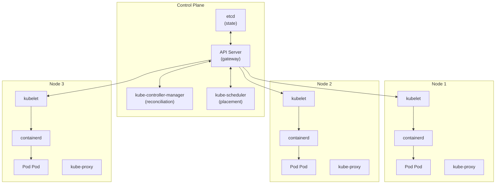
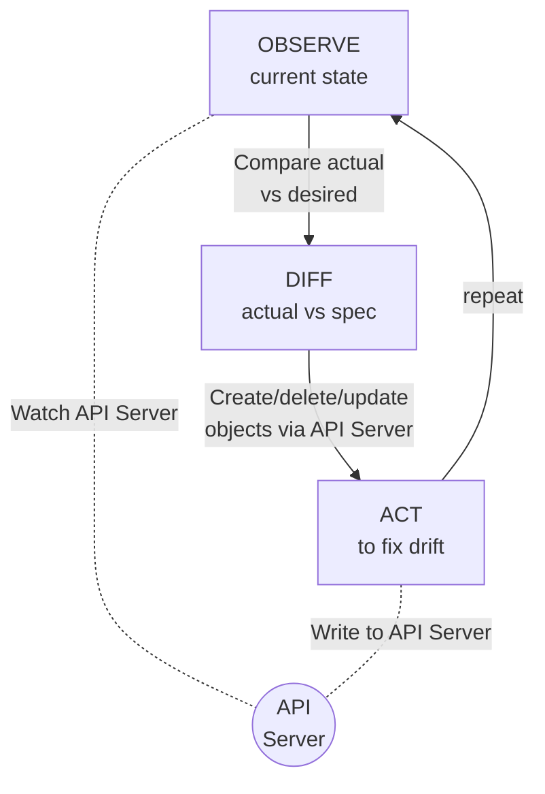

# Chapter 3: Architecture from First Principles

## The Big Picture

**Every arrow is through the API Server.** There are no direct connections between components. This is the single most important architectural constraint.

If you encounter unfamiliar terms in this chapter, see [Appendix A: Glossary](A1-glossary.md) for quick definitions.

## Why etcd? The Case for a Consistent, Distributed Key-Value Store

Kubernetes needs to store the desired state of the entire cluster: every pod specification, every service definition, every configuration map. This state must be **consistent** (all readers see the same data), **durable** (data survives machine failures), and **available** (the store can be read and written to even when some machines fail).

The CAP theorem forces a choice between consistency and availability (since network partitions are inevitable), and Kubernetes chose consistency. This is the right choice for a cluster management system: it is better to temporarily refuse writes than to allow conflicting writes that could result in two different controllers making contradictory scheduling decisions.

etcd implements the Raft consensus algorithm, which provides strong consistency (linearizability) across a cluster of typically 3 or 5 nodes. Every write must be acknowledged by a majority of nodes before it is committed. This means etcd requires a majority of nodes to commit writes: a 3-node cluster needs 2 (tolerates 1 failure), a 5-node cluster needs 3 (tolerates 2 failures). This is why etcd clusters always use an odd number of nodes --- a 4-node cluster still requires 3 for quorum, giving no additional fault tolerance over 3.

Why etcd specifically, rather than ZooKeeper, Consul, or a relational database?

- **ZooKeeper** was the incumbent choice (used by Hadoop, Kafka, and many other systems). But ZooKeeper has a complex session-based model, a limited data model (tree of znodes with size limits), and a Java-based implementation that was harder to embed. etcd offered a simpler HTTP/gRPC API, a more flexible key-value model, and was written in Go (matching Kubernetes' language).
- **Consul** was not yet mature when Kubernetes was designed.
- **Relational databases** provide strong consistency but are harder to operate in a distributed, fault-tolerant configuration. etcd's Raft-based replication is simpler to reason about and deploy than MySQL/PostgreSQL with synchronous replication.

Critically, etcd provides a **watch mechanism**: clients can subscribe to changes on a key or key prefix and receive notifications when the data changes. This is the mechanism that powers Kubernetes' reconciliation loops. Controllers do not poll etcd; they watch for changes and react to them. This makes the system event-driven and efficient.

## Why a Single API Server? The Chokepoint That Enables Everything

All access to the Kubernetes cluster state --- every read, every write, from every component --- goes through the kube-apiserver. This seems like a bottleneck, and indeed it is a deliberate chokepoint. Why?

**1. Authentication and authorization.** The API server is the single enforcement point for access control. Every request is authenticated (who is making this request?) and authorized (is this identity allowed to perform this action on this resource?). Having a single enforcement point is a fundamental security principle: it eliminates the risk of inconsistent access control across multiple entry points.

**2. Validation.** The API server validates every object before storing it in etcd. This ensures that invalid state never enters the system. Validation includes schema validation (does this object have the right fields?), semantic validation (does this pod specification reference an existing service account?), and admission control (do custom policies allow this object?).

**3. Admission control.** The API server supports admission webhooks --- external services that can examine, modify, or reject API requests. This enables powerful policy enforcement: injecting sidecar containers, enforcing naming conventions, requiring resource limits, preventing privilege escalation. The single-API-server model makes this possible because all mutations flow through one point.

**4. Watch multiplexing.** The API server multiplexes watch connections. Hundreds of controllers and kubelets watch for changes to different resources, and the API server efficiently fans out notifications from etcd changes. Without the API server as intermediary, every client would need a direct connection to etcd, which would not scale.

**5. API versioning and conversion.** The API server handles conversion between different API versions. An object stored as apps/v1 can be read as apps/v1beta1 (with appropriate conversion). This enables gradual API evolution without breaking clients.

The API server is designed to be **horizontally scalable**. You can run multiple instances behind a load balancer. Each instance is stateless --- all state is in etcd. This means the single logical API server does not become a single point of failure in practice.

## The Controller Pattern: Reconciliation as Architecture

The controller pattern is the heart of Kubernetes' architecture. A controller is a loop that:

1. **Observes** the current state of the world (by watching the API server)
2. **Compares** the current state to the desired state (as expressed in API objects)
3. **Takes action** to move the current state toward the desired state
4. **Repeats** indefinitely

This is sometimes called the **reconciliation loop** or the **observe-diff-act** pattern. It is borrowed from control theory, where it is known as a closed-loop controller. The thermostat in your house is a simple example: it observes the current temperature, compares it to the desired temperature, and turns the heater on or off.

Kubernetes runs dozens of controllers, each responsible for a specific aspect of the system:

- The **Deployment controller** watches Deployment objects and ensures the right number of ReplicaSets exist with the right template.
- The **ReplicaSet controller** watches ReplicaSet objects and ensures the right number of Pods exist.
- The **Node controller** watches nodes and detects failures.
- The **Service controller** watches Service objects and updates endpoints.
- The **Job controller** watches Job objects and creates Pods to run tasks to completion.
- The **Endpoint controller** watches Services and Pods to maintain the mapping between them.

The genius of this pattern is **decomposition**. Each controller handles exactly one concern. The Deployment controller knows nothing about nodes or networking; the ReplicaSet controller knows nothing about rolling updates. Each controller reads from and writes to the API server, and the API server provides the shared state that coordinates them.

This decomposition also provides **fault tolerance**. If the Deployment controller crashes and restarts, it simply reads the current state from the API server and resumes reconciling. No state is lost because the controller is stateless --- all state is in the API server (and ultimately in etcd). This is why Kubernetes components can be restarted at any time without corruption.

## The Watch Mechanism: Event-Driven Efficiency

Controllers need to know when things change. Polling --- periodically reading all objects --- is wasteful and slow, introducing latency proportional to the polling interval.

Kubernetes uses a **watch mechanism** instead. A controller opens a long-lived HTTP connection to the API server and says, "notify me of any changes to Deployment objects." The API server, in turn, watches etcd for changes and fans out notifications to all watching clients. This is event-driven: controllers react to changes immediately rather than discovering them on a polling interval.

The watch mechanism is implemented using HTTP chunked transfer encoding (or gRPC streaming). Each change event includes the type of change (ADDED, MODIFIED, DELETED), the object's new state, and a **resource version** --- a logical clock that enables clients to resume a watch from where they left off after a disconnection.

To handle the case where a watch connection breaks and events are missed, Kubernetes controllers use a pattern called **list and watch**: on startup, the controller lists all objects of interest (establishing a baseline), notes the resource version, and then watches for changes from that version forward. The client-go library provides an **Informer** abstraction that implements this pattern, including a local cache of objects and an event handler interface.

## The Scheduler: Separation of Concerns

The Kubernetes scheduler is a separate component from the API server and the controllers. Its job is simple but computationally intensive: when a new Pod is created without a node assignment, the scheduler selects the best node for it.

Why is the scheduler separate? Because scheduling is a fundamentally different concern from state management. The API server manages state; controllers reconcile state; the scheduler makes placement decisions. Separating these concerns allows each to evolve independently. You can replace the default scheduler with a custom one, or run multiple schedulers for different workload types, without modifying any other component.

The scheduler operates in two phases:

1. **Filtering**: Eliminate nodes that cannot run the pod (insufficient resources, incompatible taints, missing node selectors, etc.).
2. **Scoring**: Rank the remaining nodes by desirability (resource balance, affinity/anti-affinity, topology spread, etc.).

The scheduler's decision is recorded by binding the pod to a node --- setting the `spec.nodeName` field in the Pod object via the API server. The kubelet on the target node watches for pods bound to it and starts the containers.

This design means the scheduler is **advisory, not authoritative**. It makes suggestions (by binding pods to nodes), but it does not directly start containers. If the kubelet cannot run the pod (perhaps a resource changed between scheduling and execution), the pod enters a failed state and the reconciliation loop handles it.

## Kubelet: The Node Agent

The kubelet runs on every node in the cluster. It is the bridge between the Kubernetes control plane and the container runtime on the node. The kubelet:

1. Watches the API server for pods assigned to its node
2. Translates pod specifications into container runtime calls (via the Container Runtime Interface, CRI)
3. Monitors container health (via liveness and readiness probes)
4. Reports node status and pod status back to the API server

The kubelet is deliberately simple. It does not make scheduling decisions, manage networking, or handle service discovery. It is a **single-responsibility agent** that converts API state into running containers and reports back.

The kubelet's design reflects a key Kubernetes principle: **the control plane tells nodes what to do, not how to do it**. The kubelet receives a PodSpec and is free to implement it however it wants, as long as the containers end up running with the specified resources and configuration. This abstraction is what allows Kubernetes to support multiple container runtimes (containerd, CRI-O, etc.) through the CRI interface.

## Kube-Proxy: Transparent Service Networking

Kube-proxy runs on every node (or is replaced by equivalent CNI functionality) and implements the networking rules that make Services work. When a Service is created with a ClusterIP, kube-proxy programs iptables or IPVS rules on every node that intercept traffic destined for the ClusterIP and redirect it to one of the Service's backing pods.

Why does kube-proxy run on every node instead of as a centralized load balancer? Because a centralized load balancer would be a bottleneck and a single point of failure. By distributing the load-balancing rules to every node, Kubernetes ensures that Service traffic takes the most direct path: a pod on Node A talking to a Service endpoint on Node B sends traffic directly from A to B, with no intermediary.

Kube-proxy watches the API server for Service and Endpoint changes and updates the local rules accordingly. It is another example of the controller pattern: observe desired state (Service definitions), observe actual state (current iptables rules), and reconcile.

> **The Controller Pattern is Kubernetes.** If you understand only one thing about Kubernetes' architecture, understand the controller pattern: observe, diff, act, repeat. Every component --- from the scheduler to the kubelet to kube-proxy --- is a controller that watches for state changes and reconciles actual state toward desired state. This single pattern, applied recursively across the entire system, is what makes Kubernetes self-healing, scalable, and extensible.

## Common Mistakes and Misconceptions

- **"The master node runs my workloads."** Control plane nodes are dedicated to cluster management (API server, scheduler, controllers, etcd). Workloads run on worker nodes by default. Running application pods on control plane nodes is possible but strongly discouraged in production because it risks destabilizing the control plane.

- **"etcd is a general-purpose database."** etcd is optimized for small key-value metadata with a hard limit of approximately 1.5 MB per value. It is designed for storing cluster state, not application data. Treating it as an application database will lead to performance degradation and cluster instability.

- **"If the API server goes down, my pods stop."** Running pods continue to execute on their nodes even if the API server is unavailable. The kubelet keeps containers running based on its last known state. What stops is your ability to make changes, schedule new pods, or observe cluster state through the API.

- **"The scheduler continuously moves pods for better balance."** Pods are scheduled once and stay on their assigned node unless they are evicted, deleted, or the node fails. The scheduler does not rebalance running pods. If you need rebalancing, you must use tools like the Descheduler, which evicts pods so the scheduler can place them on better nodes.

## Further Reading

- [Kubernetes Official Documentation -- Cluster Architecture](https://kubernetes.io/docs/concepts/architecture/) -- The authoritative reference for how control plane and node components fit together, including component-level diagrams.
- [etcd Documentation](https://etcd.io/docs/) -- Documentation for the distributed key-value store at the heart of Kubernetes' state management, covering Raft consensus, watch mechanics, and operational best practices.
- [Kelsey Hightower -- Kubernetes The Hard Way](https://github.com/kelseyhightower/kubernetes-the-hard-way) -- A tutorial that walks through bootstrapping a Kubernetes cluster from scratch, component by component, providing deep understanding of how each piece interacts.
- [Joe Beda -- "The Road to More Usable Kubernetes" (KubeCon 2017)](https://www.youtube.com/watch?v=QQsq2Ny5a4A) --- Co-founder of Kubernetes discusses the design decisions and usability goals behind the system.
- [Daniel Smith -- "The Kubernetes Control Plane for Busy People Who Like Pictures" (KubeCon EU 2019)](https://www.youtube.com/watch?v=zCXiXKMqnuE) --- Accessible visual walkthrough of how the control plane components interact.
- [Kubernetes Documentation -- Scheduler Performance Tuning](https://kubernetes.io/docs/concepts/scheduling-eviction/scheduler-perf-tuning/) -- Details on the scheduler's filtering and scoring phases, extension points, and how to tune scheduling behavior.
- [Daniel Smith -- "A Vision For API Machinery" (KubeCon 2018)](https://www.youtube.com/watch?v=u6weI_3WVTM) --- Google engineer on the architecture and future direction of the Kubernetes API server.

---

Next: [The API Model](04-api-model.md)
