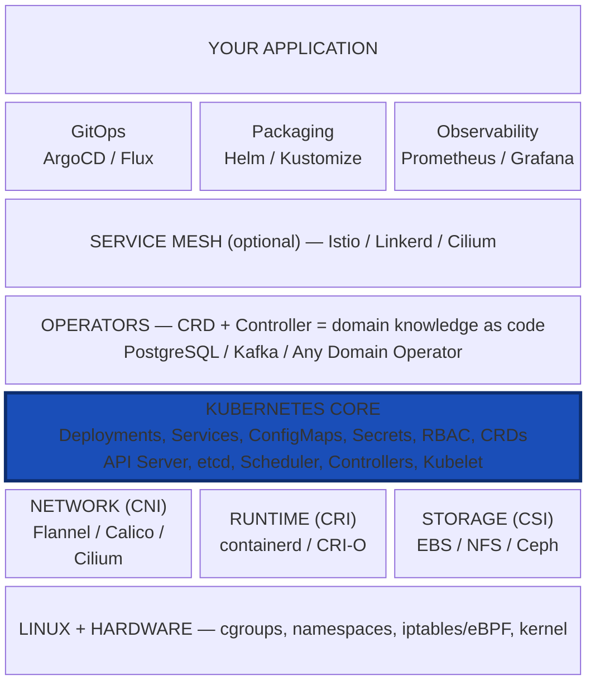

# Chapter 6: The Ecosystem — Why Operators, Helm, and Service Meshes Exist

Kubernetes provides the middle layers.
Everything above and below is pluggable.
This is "platform for platforms" by design.

## Operators: Teaching Kubernetes Domain Knowledge

The Operator pattern, introduced by CoreOS in 2016, is the most significant architectural pattern to emerge from the Kubernetes ecosystem. An Operator encodes the operational knowledge of a human domain expert into a custom controller.

Consider the problem of running a PostgreSQL database on Kubernetes. Kubernetes knows how to run containers, but it does not know how to:

- Initialize a PostgreSQL cluster with a primary and replicas
- Configure streaming replication between primary and replicas
- Perform a failover when the primary node fails
- Take point-in-time backups using WAL archiving
- Resize a cluster by adding or removing replicas
- Upgrade PostgreSQL versions with minimal downtime

A human DBA knows all of these things. An Operator encodes this knowledge into code. The Operator defines a CRD (e.g., `PostgresCluster`) and a controller that watches for `PostgresCluster` objects and reconciles them by creating and managing the underlying Kubernetes resources (StatefulSets, Services, ConfigMaps, PersistentVolumeClaims, CronJobs for backups, etc.).

The Operator pattern is powerful because it composes with Kubernetes' existing primitives --- the same API, controllers, and reconciliation loops --- adding only the domain-specific logic on top.

Operators exist for virtually every stateful application: databases (PostgreSQL, MySQL, MongoDB, CockroachDB, Cassandra), message queues (Kafka, RabbitMQ), monitoring systems (Prometheus), and many more. The OperatorHub.io registry catalogs hundreds of them.

## Helm: Package Management for Kubernetes

Helm addresses a different problem: **parameterized deployment**. A typical Kubernetes application consists of dozens of YAML files: Deployments, Services, ConfigMaps, Secrets, Ingresses, ServiceAccounts, RBAC rules. These files need to be customized for different environments (dev, staging, production) and different configurations (replicas, resource limits, feature flags).

Helm introduces the concept of a **chart**: a package of templated YAML files, a `values.yaml` file that provides default parameters, and metadata. Users install a chart with custom values, and Helm renders the templates and applies the resulting YAML to the cluster.

Helm also provides **release management**: it tracks which charts are installed, their versions, and their configuration, enabling upgrades and rollbacks. It fills the role of a package manager (like apt or npm) for Kubernetes.

Helm has been criticized for its complexity and for its templating approach (Go templates embedded in YAML is ergonomically challenging). Alternatives like Kustomize (which uses overlay-based patching rather than templating) have emerged, but Helm remains the most widely used packaging tool in the Kubernetes ecosystem, largely because of its enormous library of community-maintained charts.

## Service Meshes: The Networking Layer That Kubernetes Lacks

Kubernetes provides basic service discovery and load balancing through Services, but it does not provide:

- **Mutual TLS (mTLS)** between services: encrypting and authenticating all inter-service communication
- **Fine-grained traffic management**: canary deployments, traffic splitting, fault injection, retries, timeouts, circuit breaking
- **Observability**: distributed tracing, per-service metrics, access logging

A **service mesh** adds these capabilities by inserting a **sidecar proxy** (typically Envoy) alongside every pod. All inbound and outbound traffic flows through the sidecar, which can encrypt it, route it, observe it, and enforce policies on it. A control plane (Istio, Linkerd, Consul Connect) configures the sidecars.

Service meshes exist because Kubernetes deliberately does not implement application-level networking. Kubernetes provides the infrastructure-level network (pod IPs, Service ClusterIPs) but leaves application-level concerns (encryption, traffic management, observability) to the application or to a mesh. This is consistent with Kubernetes' design philosophy of providing building blocks rather than a complete platform.

However, service meshes add significant complexity: they increase resource consumption (each sidecar consumes CPU and memory), add latency (each hop through a sidecar adds processing time), and introduce a large new control plane to operate. Many organizations find that they can achieve sufficient security and observability with simpler approaches (network policies + application-level TLS + centralized logging) and do not need a full mesh.

## Why the Ecosystem Exists: Kubernetes as a Platform for Platforms

The common thread across Operators, Helm, and service meshes is that Kubernetes is deliberately **incomplete**. It provides primitives (pods, services, deployments, CRDs) and extension mechanisms (controllers, admission webhooks, CNI, CRI, CSI) but does not attempt to solve every problem itself --- a lesson from Borg, which tried to be everything and became too tightly coupled to evolve. Kubernetes instead adopted the Unix philosophy: do one thing well, and compose with other tools.

The result is that Kubernetes is not a platform; it is a **platform for building platforms**. Organizations build their own internal developer platforms on top of Kubernetes, combining:

- Operators for stateful services
- Helm or Kustomize for packaging
- A service mesh or CNI-level features for security
- ArgoCD or Flux for GitOps
- Prometheus and Grafana for monitoring
- Custom CRDs and controllers for domain-specific needs

This composability is both Kubernetes' greatest strength and its greatest source of complexity. The bare Kubernetes API is relatively simple; the ecosystem built on top of it is vast and sometimes overwhelming. Understanding that this is by design --- that Kubernetes provides the kernel, not the full operating system --- is essential to understanding the Kubernetes landscape.

## Common Mistakes and Misconceptions

- **"CNCF graduated means production-ready for my use case."** Graduated status indicates mature governance, broad adoption, and a proven security audit process. It does not guarantee the project is the right fit for your specific workload, scale, or operational constraints. Always evaluate projects against your own requirements.

- **"I need to install every CNCF tool."** Most production clusters need only 5-10 ecosystem tools (a CNI plugin, an ingress controller, monitoring, logging, and perhaps a GitOps tool). The CNCF landscape contains 1000+ projects; installing everything would create an unmanageable operational burden.

- **"The CNCF landscape is the complete ecosystem."** Many important Kubernetes tools live outside the CNCF, including commercial products, independent open-source projects, and cloud-provider-specific integrations. The CNCF landscape is a significant subset, not the totality of the ecosystem.

## Further Reading

- [CNCF Landscape](https://landscape.cncf.io/) -- Interactive map of the entire cloud-native ecosystem, categorized by function (orchestration, observability, service mesh, etc.), with funding and maturity data.
- [CNCF Project Maturity Levels](https://www.cncf.io/projects/) -- Explanation of the Sandbox, Incubating, and Graduated tiers, along with a full list of CNCF projects and their current status.
- [Introducing Operators (CoreOS, 2016)](https://web.archive.org/web/2023/https://coreos.com/blog/introducing-operators.html) -- The original blog post by Brandon Philips that introduced the Operator pattern, explaining why encoding operational knowledge in code is a natural extension of Kubernetes controllers.
- [CNCF Annual Survey Results](https://www.cncf.io/reports/) -- Yearly survey data on Kubernetes adoption rates, ecosystem tool usage, and deployment patterns across organizations worldwide.
- [KubeCon + CloudNativeCon Talk Recordings](https://www.youtube.com/@cncf/playlists) -- Full archives of KubeCon presentations covering operators, Helm, service meshes, and every other corner of the ecosystem.
- [Helm Documentation](https://helm.sh/docs/) -- Official docs for the most widely used Kubernetes package manager, covering chart authoring, templating, release management, and repository hosting.
- [Kubernetes Service Mesh: A Comparison of Istio, Linkerd and Consul (Platform9)](https://platform9.com/blog/kubernetes-service-mesh-a-comparison-of-istio-linkerd-and-consul/) -- Detailed comparison of the major service mesh implementations across 16 factors, covering architectures, performance characteristics, and ideal use cases.

---

Next: [Key Design Principles](07-design-principles.md)
