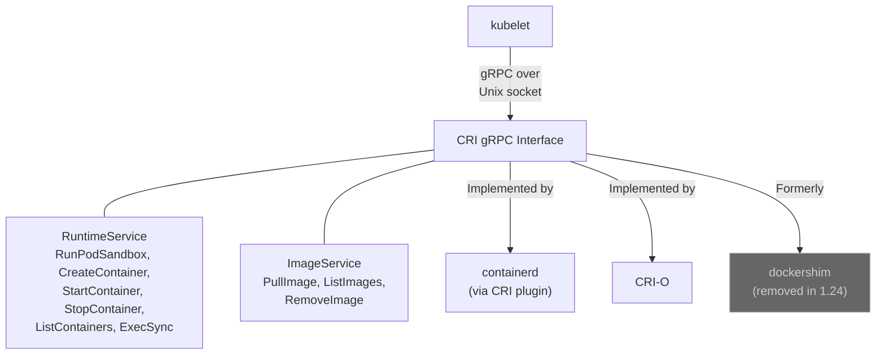
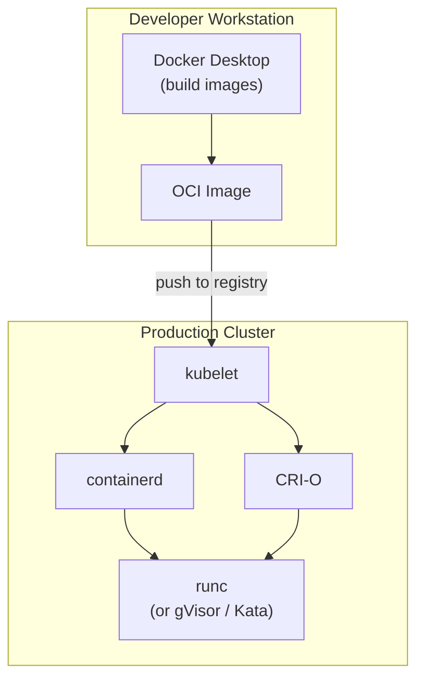

# Chapter 10: The Container Runtime Wars

```
The Evolution of Container Runtimes in Kubernetes

Era 1 (2014-2016):   kubelet ---> Docker Engine (which used libcontainer/runc internally)
                     "The only option. Docker was a monolith."

Era 2 (2016-2020):   kubelet ---> dockershim ---> Docker Engine ---> containerd ---> runc
                     "CRI exists, but Docker doesn't speak it. Add another layer."

Era 3 (2018+):       kubelet ---> CRI ---> containerd ---> runc
                      kubelet ---> CRI ---> CRI-O ------> runc
                     "Direct communication. Docker removed from the chain."
```

## Docker's Original Role: From Monolith to Layers

To understand the container runtime wars, you must first understand how Docker evolved. In the early days (2014-2016), Docker Engine was a monolithic daemon. It used an internal library called **libcontainer** (later extracted and renamed to **runc**) to interact with the Linux kernel, setting up namespaces, cgroups, and filesystem mounts. There was no separate "containerd" layer yet --- Docker Engine handled everything from the user-facing API down to container creation in a single process.

When Kubernetes launched in 2014-2015, it talked to Docker Engine directly. The kubelet called the Docker API, and Docker Engine internally used libcontainer/runc to create containers. Kubernetes was only using a fraction of what Docker Engine provided. It did not need Docker Compose, Docker Swarm, or Docker's build system. It needed exactly one capability: run containers.

In December 2016, Docker began decomposing its monolith. It extracted the core container lifecycle management into a separate daemon called **containerd**, and the low-level container creation into **runc** (the graduated form of libcontainer). This produced the layered architecture that later versions used:

- **runc** --- a low-level tool that did exactly one thing: create and run a container according to the OCI (Open Container Initiative) runtime specification.
- **containerd** --- a daemon that managed the lifecycle of containers: image pulling, storage, container execution (by calling runc), and networking setup.
- **Docker Engine (dockerd)** --- the daemon that provided the Docker API, Docker CLI integration, Docker Compose support, Docker Swarm orchestration, build functionality, and all the user-facing features that made Docker popular. dockerd talked to containerd, which talked to runc.

With this decomposition, every container operation now went through three layers: kubelet called the Docker API, Docker Engine called containerd, containerd called runc. Each layer added latency, complexity, and potential failure modes.

This was like hiring a general contractor, a subcontractor, and a specialist every time you needed to hammer a single nail.

## The CRI: Defining a Standard Interface

Before Kubernetes 1.5 (December 2016), the kubelet had direct knowledge of how to talk to Docker compiled into its source code. If you wanted to use a different container runtime --- say, rkt from CoreOS --- the code for that runtime also had to be compiled into the kubelet binary. This meant the kubelet was tightly coupled to every runtime it supported. Adding a new runtime required modifying kubelet source code, getting the changes reviewed and merged, and waiting for a Kubernetes release. This did not scale.

The **Container Runtime Interface (CRI)** was introduced in Kubernetes 1.5 to solve this problem. CRI defined a gRPC-based interface with two services:

- **RuntimeService**: operations on containers and pods (create, start, stop, remove, list, status, exec, attach, port-forward)
- **ImageService**: operations on container images (pull, list, remove, image status)

Any container runtime that implemented this gRPC interface could be plugged into the kubelet without modifying kubelet source code. The kubelet would communicate with the runtime over a Unix socket, and the runtime would handle everything from there.

This was a critical architectural decision --- the same design philosophy that Kubernetes applied to networking (CNI), storage (CSI), and cloud providers. Define a clean interface, let implementations compete, and avoid coupling the core system to any particular vendor.



## The Dockershim: A Bridge to Nowhere

There was a problem. Docker Engine predated CRI by several years and did not implement it. Docker had its own API, its own assumptions, its own way of doing things. But Docker was the dominant runtime --- virtually every Kubernetes cluster in production used Docker. Kubernetes could not simply drop Docker support overnight.

The solution was the **dockershim** --- a CRI-compatible shim layer that translated CRI calls into Docker Engine API calls. The kubelet would speak CRI to the dockershim, and the dockershim would translate those calls into the Docker API. The dockershim was maintained inside the kubelet codebase itself, making the kubelet responsible for keeping up with every Docker API change.

The call chain became even longer:

```
kubelet ---> dockershim ---> Docker Engine (dockerd) ---> containerd ---> runc
```

Four layers of indirection to start a container. And the dockershim added a particular kind of burden: because it lived in the kubelet codebase, every Kubernetes release had to ensure compatibility with Docker. Docker bugs became kubelet bugs. Docker's release cycle constrained Kubernetes' release cycle. The dockershim was approximately 2,000 lines of complex translation code that had to be maintained by the Kubernetes community despite being, conceptually, Docker's problem.

This situation was unsustainable. The Kubernetes community was maintaining a compatibility shim for one specific vendor's product inside its core codebase.

## containerd Goes Standalone

Docker itself recognized the architectural problem. In 2017, Docker donated containerd to the Cloud Native Computing Foundation (CNCF) as an independent project. This was a significant move: containerd was no longer "Docker's internal component" but an independent, community-governed container runtime.

containerd 1.1, released in 2018, added **native CRI support** through a built-in CRI plugin. This meant containerd could speak CRI directly --- the kubelet could talk to containerd without Docker Engine in the middle. The call chain collapsed:

```
Before:   kubelet ---> dockershim ---> dockerd ---> containerd ---> runc
After:    kubelet ---> CRI ---> containerd ---> runc
```

Two layers were eliminated. The result was faster container operations, fewer potential failure points, and lower resource overhead (no Docker daemon consuming memory and CPU for features Kubernetes did not use).

## CRI-O: The Minimal Alternative

Red Hat took a different approach. Rather than adapting an existing runtime, they built **CRI-O** from scratch as a minimal CRI implementation --- just enough runtime to support Kubernetes, nothing more. CRI-O's motto was effectively "Kubernetes' container runtime."

CRI-O did not support Docker Compose. It did not support Docker Swarm. It did not have a CLI for building images. It implemented the CRI gRPC interface and managed containers using runc (or any OCI-compliant low-level runtime). It was purpose-built for Kubernetes and nothing else.

This minimalism had real advantages:

- **Smaller attack surface**: less code means fewer vulnerabilities
- **Version alignment**: CRI-O versions are aligned 1:1 with Kubernetes versions (CRI-O 1.24 works with Kubernetes 1.24)
- **Predictable behavior**: no features outside the CRI specification that could cause unexpected interactions
- **Lighter weight**: lower memory and CPU overhead than Docker Engine or even containerd (which supports non-CRI use cases)

Red Hat adopted CRI-O as the default runtime for OpenShift, their enterprise Kubernetes distribution. This gave CRI-O a significant production footprint and a well-funded development team.

## The Deprecation That Shook the Community

In December 2020, Kubernetes 1.20 included a deprecation warning: dockershim would be removed in a future release. In May 2022, Kubernetes 1.24 completed the removal.

The announcement caused widespread panic. Blog posts declared "Kubernetes is dropping Docker support!" Twitter erupted with confusion. Many users believed their Docker images would stop working, that their Dockerfiles were obsolete, that they needed to rebuild everything.

**None of this was true.** The confusion stemmed from conflating "Docker" the image format with "Docker" the runtime engine.

Here is what actually happened:

- Docker images are **OCI images**. The Open Container Initiative defined a standard image format, and Docker images conform to it. containerd, CRI-O, and every other OCI-compliant runtime can pull and run Docker images. Nothing changed about images.
- Dockerfiles continued to work. They produce OCI-compliant images. It does not matter what builds the image; what matters is that the output conforms to the OCI specification.
- What was removed was the **dockershim** --- the translation layer inside the kubelet that allowed Kubernetes to talk to Docker Engine. If you were running Docker Engine as your container runtime, you needed to switch to containerd or CRI-O. Since Docker Engine itself used containerd internally, this switch was straightforward: containerd was already on the machine, it just needed to be configured as the CRI endpoint.

The deprecation was, in a sense, a non-event for users. Their workflows did not change. Their images did not change. Their Dockerfiles did not change. What changed was which daemon the kubelet talked to on each node --- an infrastructure detail that most application developers never interacted with directly.

But the deprecation was a significant event for the Kubernetes project. It removed approximately 2,000 lines of shim code from the kubelet, eliminated an entire class of compatibility bugs, and completed the transition to a clean, pluggable runtime architecture that CRI had promised since 2016.

## The Current Landscape

Today, the container runtime landscape has settled into a clear pattern:

**containerd** is the dominant runtime. Amazon EKS, Google GKE, Microsoft AKS, and most managed Kubernetes services use containerd as their default runtime. containerd is mature, well-tested, and supports a broad range of use cases beyond just Kubernetes (it is also used by Docker Desktop, nerdctl, and other tools).

**CRI-O** is the standard runtime for Red Hat OpenShift and is used in environments where minimalism and strict Kubernetes alignment are priorities.

**Docker Desktop** remains the most popular tool for local container development. Developers build images with Docker, push them to registries, and those images run on containerd or CRI-O in production. Docker's role shifted from "the runtime" to "the developer tool."

**Specialized runtimes** exist for specific use cases: gVisor (Google) provides kernel-level sandboxing for stronger isolation, Kata Containers runs each container in a lightweight VM for hardware-level isolation, and Firecracker (AWS) powers Lambda and Fargate with microVMs. All of these can be plugged into Kubernetes through CRI, demonstrating the power of the pluggable interface.



The lesson they teach is a design lesson: **define clean interfaces early, and the ecosystem will sort itself out.** CRI turned the container runtime from a hardwired dependency into a pluggable component, and the result was a healthier ecosystem where runtimes could compete on merit without requiring changes to Kubernetes core. The removal of dockershim, despite the community anxiety it caused, was the natural conclusion of a process that began six years earlier with the introduction of CRI.

## Common Mistakes and Misconceptions

- **"I need Docker installed to run containers on Kubernetes."** Since K8s 1.24, dockershim was removed. Kubernetes uses containerd or CRI-O directly. Docker is a development tool, not a K8s runtime dependency.
- **"containerd and Docker are completely different."** containerd was extracted from Docker. Docker uses containerd internally. The difference is that K8s talks to containerd directly via CRI, skipping the Docker daemon.
- **"OCI images built with Docker won't work with containerd."** OCI images are runtime-agnostic. An image built with `docker build` runs identically on containerd, CRI-O, or any OCI-compliant runtime.

For a visual timeline of how container runtimes evolved alongside the broader ecosystem, see [Appendix E: Architecture Evolution Timeline](A5-timeline.md).

## Further Reading

- [Container Runtime Interface (CRI) specification](https://github.com/kubernetes/cri-api) -- The formal API definition that decoupled Kubernetes from any single container runtime, enabling the pluggable ecosystem described in this chapter.
- [containerd documentation](https://containerd.io/docs/) -- Official docs for the dominant container runtime, covering architecture, configuration, and the plugin system that makes containerd extensible beyond Kubernetes.
- [CRI-O documentation](https://cri-o.io/) -- The lightweight, Kubernetes-dedicated runtime used by OpenShift. Useful for understanding the "do one thing well" design philosophy contrasted with containerd's broader scope.
- [KEP-2221: Dockershim Removal](https://github.com/kubernetes/enhancements/tree/master/keps/sig-node/2221-remove-dockershim) -- The Kubernetes Enhancement Proposal that formalized the dockershim removal, including the rationale, migration plan, and community discussion.
- ["Don't Panic: Kubernetes and Docker" (Kubernetes blog)](https://kubernetes.io/blog/2020/12/02/dont-panic-kubernetes-and-docker/) -- The official blog post that clarified the Docker deprecation, explaining why Docker images still work and what actually changed. Essential reading for understanding the community communication around this transition.
- [OCI Runtime Specification](https://github.com/opencontainers/runtime-spec) -- The standard that defines how a container runtime starts and manages containers at the lowest level. Understanding this spec clarifies the relationship between high-level runtimes (containerd, CRI-O) and low-level runtimes (runc).
- [runc GitHub repository](https://github.com/opencontainers/runc) -- The reference implementation of the OCI runtime spec and the low-level runtime that actually creates containers for both containerd and CRI-O. Reading the README provides a clear picture of what happens at the bottom of the runtime stack.

---

**Next:** [Chapter 11: Bootstrapping a Cluster --- From kube-up.sh to kubeadm](11-cluster-bootstrap.md)
