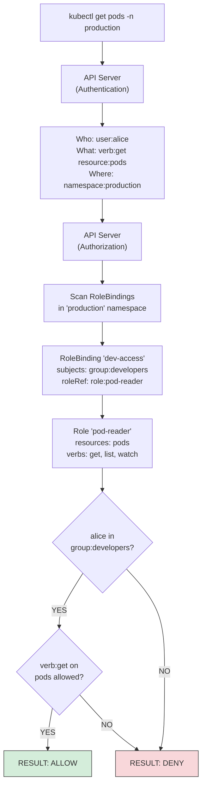
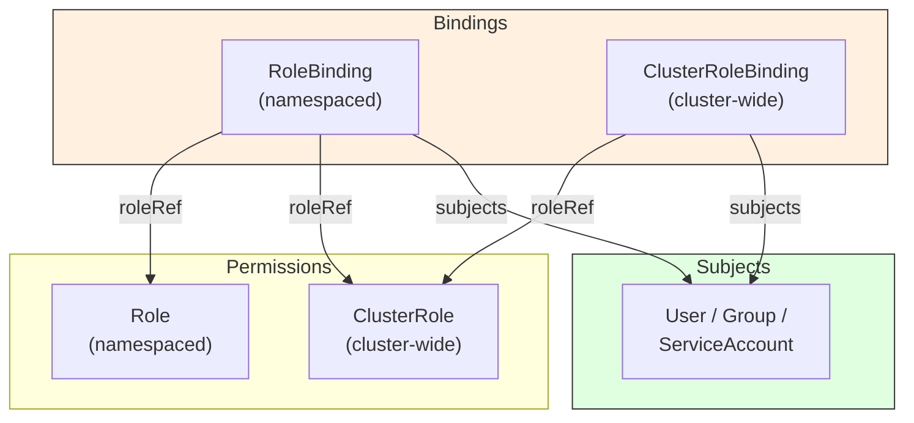

# Chapter 25: RBAC from First Principles

Kubernetes has no firewall between "can deploy an app" and "can delete the entire cluster." Without access control, every user and every workload operates with full administrative privileges. Role-Based Access Control (RBAC) is the mechanism that prevents a junior developer's typo from becoming a production incident and ensures that a compromised pod cannot read every secret in the cluster.

RBAC answers a single question: **who can do what to which resources?** Understanding it from first principles requires understanding the four objects that encode that answer, the subjects they reference, and the design patterns that make multi-tenant clusters safe.

## The Authorization Model

In [Chapter 3](03-architecture.md), we described the API server as the gateway that every request must pass through. The API server authenticates every request, then authorizes it --- RBAC is the authorization module used by virtually every production cluster.

Every request to the Kubernetes API server carries three pieces of information relevant to authorization:

1. **Subject** --- who is making the request (user, group, or service account)
2. **Verb** --- what action is being attempted (get, list, create, update, delete, watch, patch)
3. **Resource** --- what is being acted upon (pods, services, secrets, configmaps, etc.)

RBAC evaluates these against a set of rules. If any rule grants the requested action, the request is allowed. If no rule matches, the request is denied. RBAC is **additive-only** --- there is no way to write a "deny" rule. You grant permissions; you never revoke them. If a subject has no matching grants, the default is denial.



## The Four RBAC Objects

RBAC uses exactly four object types. Two define permissions, two bind permissions to subjects.



> **Key insight:** A RoleBinding can reference a ClusterRole. This grants the ClusterRole's permissions **only within the RoleBinding's namespace**. This is the most common pattern for multi-tenant clusters.

### Role

A Role defines permissions within a single namespace. It lists which API resources can be accessed and which verbs are allowed.

```yaml
apiVersion: rbac.authorization.k8s.io/v1
kind: Role
metadata:
  name: pod-reader
  namespace: production
rules:
  - apiGroups: [""]            # "" = core API group
    resources: ["pods"]
    verbs: ["get", "list", "watch"]
  - apiGroups: [""]
    resources: ["pods/log"]    # subresource
    verbs: ["get"]
```

### ClusterRole

A ClusterRole defines permissions cluster-wide. It can also grant access to cluster-scoped resources (nodes, namespaces, persistentvolumes) that have no namespace.

```yaml
apiVersion: rbac.authorization.k8s.io/v1
kind: ClusterRole
metadata:
  name: node-reader
rules:
  - apiGroups: [""]
    resources: ["nodes"]
    verbs: ["get", "list", "watch"]
  - apiGroups: [""]
    resources: ["namespaces"]
    verbs: ["get", "list"]
```

### RoleBinding

A RoleBinding grants permissions defined in a Role (or ClusterRole) to a set of subjects within a specific namespace.

```yaml
apiVersion: rbac.authorization.k8s.io/v1
kind: RoleBinding
metadata:
  name: dev-pod-access
  namespace: production
subjects:
  - kind: Group
    name: developers
    apiGroup: rbac.authorization.k8s.io
  - kind: ServiceAccount
    name: ci-deployer
    namespace: ci-system
roleRef:
  kind: Role
  name: pod-reader
  apiGroup: rbac.authorization.k8s.io
```

### ClusterRoleBinding

A ClusterRoleBinding grants cluster-wide permissions. Every namespace, plus cluster-scoped resources, are accessible.

```yaml
apiVersion: rbac.authorization.k8s.io/v1
kind: ClusterRoleBinding
metadata:
  name: cluster-admins
subjects:
  - kind: Group
    name: platform-team
    apiGroup: rbac.authorization.k8s.io
roleRef:
  kind: ClusterRole
  name: cluster-admin
  apiGroup: rbac.authorization.k8s.io
```

## Subjects: Who Can Be Granted Access

RBAC recognizes three kinds of subjects:

**User** --- An external identity authenticated by the API server. Kubernetes has no User object; users are established through client certificates, bearer tokens, or an external identity provider. The username is a string extracted during authentication.

**Group** --- A set of users. Groups are also strings extracted during authentication. The identity provider (OIDC, certificates) determines group membership. Key built-in groups: `system:authenticated` (all authenticated users), `system:unauthenticated` (anonymous requests), `system:masters` (unconditional full access).

**ServiceAccount** --- A namespaced Kubernetes object representing a workload's identity. Unlike users and groups, ServiceAccounts are managed through the API. Every pod runs as a ServiceAccount; if none is specified, it runs as the `default` ServiceAccount in its namespace.

## Default ClusterRoles

Kubernetes ships with a set of default ClusterRoles designed for common access patterns. These are the building blocks for most RBAC configurations:

| ClusterRole | Scope | Permissions |
|-------------|-------|-------------|
| **cluster-admin** | Cluster-wide | Everything. Full access to all resources in all namespaces. Equivalent to root. |
| **admin** | Namespace (via RoleBinding) | Full access within a namespace: create/update/delete Roles, RoleBindings, all workloads, secrets, configmaps. Cannot modify namespace quotas or the namespace itself. |
| **edit** | Namespace (via RoleBinding) | Create/update/delete workloads, services, configmaps, secrets, PVCs. Cannot manage Roles or RoleBindings. |
| **view** | Namespace (via RoleBinding) | Read-only access to most namespace resources. Cannot view secrets. |

The typical pattern is to bind these ClusterRoles via RoleBindings in specific namespaces, not via ClusterRoleBindings:

```yaml
# Grant "edit" in the "staging" namespace to the QA team
apiVersion: rbac.authorization.k8s.io/v1
kind: RoleBinding
metadata:
  name: qa-edit
  namespace: staging
subjects:
  - kind: Group
    name: qa-team
    apiGroup: rbac.authorization.k8s.io
roleRef:
  kind: ClusterRole         # Reference a ClusterRole...
  name: edit
  apiGroup: rbac.authorization.k8s.io
# ...but the binding is namespaced, so permissions apply only in "staging"
```

## Aggregated ClusterRoles

Aggregated ClusterRoles solve a subtle problem: when you install a CRD (Custom Resource Definition), how do the default roles (admin, edit, view) learn about the new resource types?

The answer is label-based aggregation. The default ClusterRoles have an `aggregationRule` that selects other ClusterRoles by label. When you create a CRD, you create small ClusterRoles with the appropriate labels, and their rules are automatically merged into the aggregated roles.

```yaml
# This ClusterRole's rules get merged into "admin"
apiVersion: rbac.authorization.k8s.io/v1
kind: ClusterRole
metadata:
  name: custom-app-admin
  labels:
    rbac.authorization.k8s.io/aggregate-to-admin: "true"
rules:
  - apiGroups: ["mycompany.io"]
    resources: ["widgets"]
    verbs: ["get", "list", "watch", "create", "update", "delete"]
```

Any user who has `admin` access in a namespace now automatically gets full access to `widgets` in that namespace. No manual RoleBinding updates required.

## ServiceAccount Tokens: The Modern Model

Kubernetes v1.24 removed the automatic creation of long-lived ServiceAccount token secrets. The modern model uses **bound service account tokens** with four important properties:

1. **Time-bound** --- Tokens expire (default: 1 hour; the kubelet proactively rotates the token when 80% of its lifetime has elapsed, i.e., ~48 minutes by default)
2. **Audience-scoped** --- Tokens are valid only for specific audiences (typically the API server)
3. **Pod-bound** --- Tokens are invalidated when the pod is deleted
4. **Auto-rotated** --- The kubelet refreshes tokens before expiration

This is a significant security improvement over the old model, where a leaked ServiceAccount token granted permanent access until manually revoked.

```yaml
# Explicit token request for non-Kubernetes consumers
apiVersion: v1
kind: Pod
metadata:
  name: my-app
spec:
  serviceAccountName: my-app-sa
  containers:
    - name: app
      image: my-app:latest
      volumeMounts:
        - name: token
          mountPath: /var/run/secrets/tokens
  volumes:
    - name: token
      projected:
        sources:
          - serviceAccountToken:
              path: api-token
              expirationSeconds: 3600
              audience: my-external-service
```

## OIDC Integration for Human Users

Production clusters should authenticate human users via OIDC rather than client certificates, which cannot be revoked once issued. Use OpenID Connect (OIDC) to delegate authentication to an identity provider (Okta, Azure AD, Google Workspace, Dex).

The flow works as follows:

1. User authenticates with the identity provider (browser-based login)
2. Identity provider issues an ID token (JWT) containing username and groups
3. kubectl sends the ID token with each API request
4. API server validates the token signature against the OIDC provider's public keys
5. RBAC evaluates the extracted username and groups against bindings

This means group membership is managed in your identity provider, not in Kubernetes. When someone leaves the team, disabling their IdP account immediately revokes cluster access.

## Multi-Tenant RBAC Design

Most production clusters serve multiple teams. The standard model is **namespace-per-tenant** with a three-tier access structure:

```
MULTI-TENANT NAMESPACE MODEL
──────────────────────────────

  Cluster
  ├── Namespace: team-alpha-dev
  │   ├── RoleBinding: alpha-devs → ClusterRole:edit
  │   ├── RoleBinding: alpha-leads → ClusterRole:admin
  │   ├── RoleBinding: platform-team → ClusterRole:admin
  │   └── ResourceQuota + LimitRange
  │
  ├── Namespace: team-alpha-prod
  │   ├── RoleBinding: alpha-ci → ClusterRole:edit   (ServiceAccount)
  │   ├── RoleBinding: alpha-leads → ClusterRole:admin
  │   ├── RoleBinding: platform-team → ClusterRole:admin
  │   └── ResourceQuota + LimitRange
  │
  ├── Namespace: team-beta-dev
  │   ├── RoleBinding: beta-devs → ClusterRole:edit
  │   ├── RoleBinding: beta-leads → ClusterRole:admin
  │   ├── RoleBinding: platform-team → ClusterRole:admin
  │   └── ResourceQuota + LimitRange
  │
  └── Namespace: kube-system (platform only)
      └── ClusterRoleBinding: platform-team → cluster-admin

  THREE-TIER MODEL
  ─────────────────
  Tier 1: Platform Team    → cluster-admin (ClusterRoleBinding)
  Tier 2: Team Leads       → admin per namespace (RoleBinding)
  Tier 3: Developers       → edit per namespace (RoleBinding)
```

**Design principles:**

- **Bind to Groups, not Users.** When Alice joins team-alpha, add her to the `alpha-devs` group in your identity provider. No Kubernetes RBAC changes needed.
- **Use ClusterRoles with namespaced RoleBindings.** Define permissions once, apply per-namespace.
- **Every namespace gets ResourceQuota and LimitRange.** RBAC controls what you can do; quotas control how much.
- **CI/CD uses dedicated ServiceAccounts** with edit permissions scoped to specific namespaces. Never share ServiceAccounts across pipelines.

## Least Privilege Checklist

1. Every workload has its own ServiceAccount
2. `automountServiceAccountToken: false` unless the workload needs API access
3. No ClusterRoleBindings to cluster-admin except for the platform team
4. No wildcard verbs or resources in custom Roles
5. Groups (not individual users) in all RoleBindings
6. OIDC for human users, bound tokens for workloads
7. Regular audits of who can access secrets and create pods (pod creation implies secret access)

## Common Mistakes and Misconceptions

- **"cluster-admin for everyone is fine in dev."** Bad habits in dev carry to production. Practice least-privilege from the start. Create namespace-scoped roles that match what each team actually needs.
- **"RBAC denies by default, so I'm secure."** RBAC only controls API access. It doesn't prevent a compromised pod from attacking the network, reading the filesystem, or accessing cloud metadata. RBAC is one layer of defense, not the whole strategy.
- **"I can see who has access by reading RoleBindings."** Aggregated ClusterRoles, group memberships, and impersonation make the effective permission set non-obvious. Use `kubectl auth can-i --list --as=user` to audit actual permissions.

## Further Reading

- [RBAC documentation](https://kubernetes.io/docs/reference/access-authn-authz/rbac/) --- Official reference
- [Using RBAC Authorization](https://kubernetes.io/docs/reference/access-authn-authz/rbac/) --- API details and examples
- [Authenticating with OIDC](https://kubernetes.io/docs/reference/access-authn-authz/authentication/#openid-connect-tokens) --- OIDC configuration
- [Bound Service Account Tokens](https://kubernetes.io/docs/reference/access-authn-authz/service-accounts-admin/) --- Token projection and rotation
- [RBAC.dev](https://rbac.dev/) --- Interactive RBAC lookup and visualization tool

---

*Next: [Network Policies](26-network-policies.md) --- Controlling pod-to-pod traffic with ingress and egress rules.*
