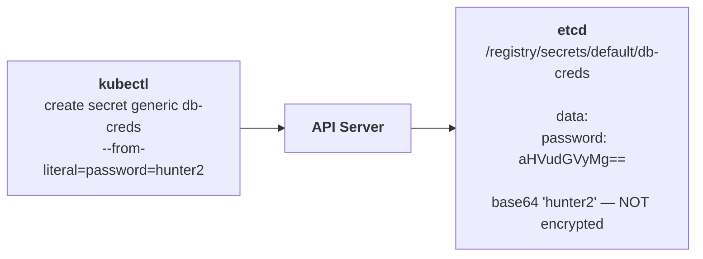
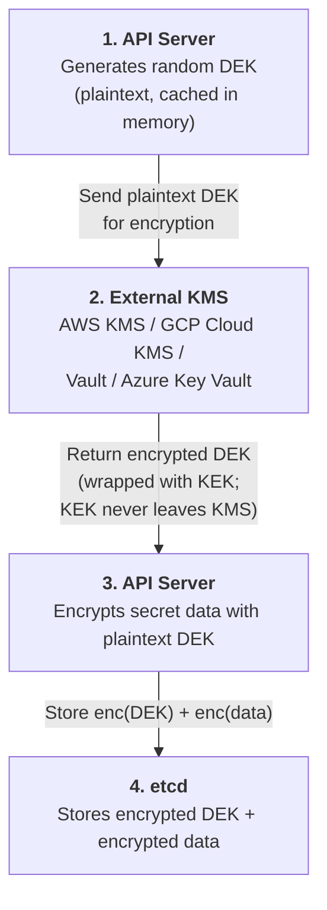
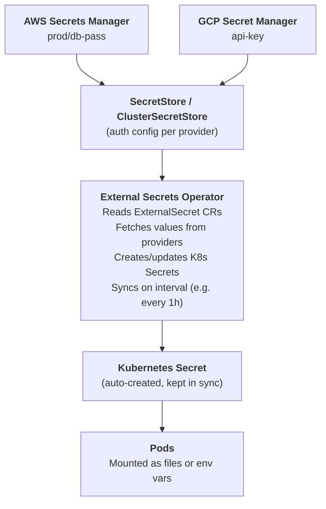

# Chapter 28: Secrets Management

Kubernetes Secrets are base64-encoded. This is not encryption. Base64 is a reversible encoding --- `echo "cGFzc3dvcmQxMjM=" | base64 -d` produces `password123` instantly. Every tutorial mentions this, yet production clusters routinely store database passwords, API keys, and TLS certificates in Secrets with no additional protection. The data sits in etcd in plaintext (or rather, in trivially decodable base64), readable by anyone with access to the etcd data directory or sufficient RBAC permissions.

This chapter covers the full spectrum of secrets protection: encrypting data at rest in etcd, integrating with external key management systems, and using external secrets operators that keep sensitive data out of Kubernetes entirely.

## The Default: No Encryption

When you create a Secret, Kubernetes stores it in etcd. By default, the `identity` provider is used, which means the data is stored as-is (base64-encoded, not encrypted). Anyone with read access to etcd --- a backup, a compromised node, a misconfigured endpoint --- can read every secret in the cluster.



## Encryption at Rest

Kubernetes supports encrypting Secret data before it reaches etcd. You configure this through an `EncryptionConfiguration` file referenced by the API server's `--encryption-provider-config` flag.

### Encryption Providers

| Provider | Algorithm | Key Management | Use Case |
|----------|-----------|---------------|----------|
| **identity** | None (plaintext) | N/A | Default. Insecure. |
| **aescbc** | AES-256-CBC | Static key in config file | Simple encryption. Key is on disk alongside the API server. |
| **aesgcm** | AES-256-GCM | Static key in config file | Authenticated encryption (integrity + confidentiality). Uses random 96-bit nonces (collision risk negligible). Key rotation still recommended. |
| **secretbox** | XSalsa20-Poly1305 | Static key in config file | Modern authenticated encryption. Preferred over aescbc/aesgcm for static key scenarios. |
| **kms v2** | Envelope encryption | External KMS (AWS KMS, GCP KMS, Azure Key Vault, HashiCorp Vault) | Production-grade. Keys never leave the KMS. |

### Basic EncryptionConfiguration

```yaml
apiVersion: apiserver.config.k8s.io/v1
kind: EncryptionConfiguration
resources:
  - resources:
      - secrets
    providers:
      - secretbox:                    # Primary: encrypt with secretbox
          keys:
            - name: key1
              secret: <base64-encoded-32-byte-key>
      - identity: {}                  # Fallback: read unencrypted data
```

The provider order matters. The **first** provider is used for writing (encrypting new secrets). All listed providers are tried for reading (so you can decrypt data written by a previous provider during key rotation). The `identity` provider at the end ensures that secrets written before encryption was enabled can still be read.

## KMS v2 Envelope Encryption

Static keys stored in configuration files have an obvious weakness: the key is on the same machine as the encrypted data. If someone compromises the API server node, they have both the ciphertext and the key. KMS v2 solves this with **envelope encryption**.



> **Key insight:** The KEK never leaves the KMS. Even if etcd is fully compromised, the attacker has encrypted data and an encrypted DEK but no way to decrypt either without KMS access. The plaintext DEK is cached in API Server memory and never written to disk.

### KMS v2 Configuration

```yaml
apiVersion: apiserver.config.k8s.io/v1
kind: EncryptionConfiguration
resources:
  - resources:
      - secrets
    providers:
      - kms:
          apiVersion: v2
          name: aws-kms-provider
          endpoint: unix:///var/run/kmsplugin/socket.sock
          timeout: 3s
      - identity: {}
```

The KMS plugin runs as a separate process (typically a DaemonSet or static pod on control plane nodes) that translates between the Kubernetes KMS gRPC protocol and your cloud provider's KMS API.

### Key Rotation

For static key providers, rotation requires three steps:

1. Add the new key as the first entry in the `keys` list (so new writes use it)
2. Restart the API server to pick up the configuration change
3. Re-encrypt all existing secrets: `kubectl get secrets --all-namespaces -o json | kubectl replace -f -`
4. Remove the old key from the configuration

For KMS v2, rotation happens in the KMS itself. When you rotate the KEK in AWS KMS or GCP Cloud KMS, new DEKs are wrapped with the new KEK. Existing secrets are re-encrypted on next write or via the re-encryption command above.

## External Secrets Solutions

Encrypting at rest protects data in etcd, but the secrets still exist as Kubernetes Secret objects --- visible to anyone with RBAC read access, exposed in pod environment variables, logged by admission webhooks. External secrets solutions keep the canonical secret in an external system and sync or inject it into pods.

### Sealed Secrets

**What it is:** A controller that encrypts secrets with a public key so they can be safely stored in Git. Only the controller running in the cluster has the private key to decrypt them.

**How it works:** You use `kubeseal` to encrypt a Secret into a SealedSecret custom resource. The SealedSecret can be committed to Git. The controller decrypts it and creates the corresponding Secret in the cluster.

```bash
# Encrypt a secret for Git storage
kubectl create secret generic db-creds \
  --from-literal=password=hunter2 --dry-run=client -o yaml \
  | kubeseal --controller-namespace kube-system \
    --controller-name sealed-secrets -o yaml > sealed-db-creds.yaml
```

**Trade-offs:** Simple to deploy, works with GitOps, no external dependencies beyond the controller. But the decrypted Secret still exists in etcd as a standard Kubernetes Secret. Sealed Secrets protect the Git side, not the runtime side.

### External Secrets Operator (ESO)

**What it is:** A controller that syncs secrets from external providers (AWS Secrets Manager, GCP Secret Manager, Azure Key Vault, HashiCorp Vault, 1Password, and many more) into Kubernetes Secrets.



```yaml
# SecretStore: how to authenticate to the provider
apiVersion: external-secrets.io/v1beta1
kind: SecretStore
metadata:
  name: aws-secrets
  namespace: production
spec:
  provider:
    aws:
      service: SecretsManager
      region: us-east-1
      auth:
        jwt:
          serviceAccountRef:
            name: eso-sa    # Uses IRSA for authentication
---
# ExternalSecret: what to sync
apiVersion: external-secrets.io/v1beta1
kind: ExternalSecret
metadata:
  name: db-credentials
  namespace: production
spec:
  refreshInterval: 1h
  secretStoreRef:
    name: aws-secrets
  target:
    name: db-credentials     # Name of the K8s Secret to create
  data:
    - secretKey: password
      remoteRef:
        key: prod/database/password
```

### HashiCorp Vault

Vault provides dynamic secret generation (short-lived database credentials created on demand), PKI certificate issuance, transit encryption (encrypt data without exposing keys), and detailed audit logging.

Vault integrates with Kubernetes in three ways:

**Agent Sidecar Injector** --- A mutating webhook injects a Vault Agent sidecar into pods. The agent authenticates to Vault using the pod's ServiceAccount, retrieves secrets, and writes them to a shared volume. The application reads secrets from files.

**CSI Provider** --- The Vault CSI provider mounts secrets as a CSI volume. Simpler than the sidecar approach but with fewer features (no dynamic renewal).

**Vault Secrets Operator (VSO)** --- The newest approach. A Kubernetes operator that syncs Vault secrets into Kubernetes Secret objects, similar to ESO but Vault-specific and with native Vault features like dynamic secrets and lease renewal.

### Comparison

See [Appendix C: Decision Trees](A3-decision-trees.md) for a secret management decision flowchart.

| Feature | Sealed Secrets | ESO | Vault |
|---------|---------------|-----|-------|
| **Complexity** | Low | Medium | High |
| **External dependency** | None (controller only) | Cloud provider secrets service | Vault cluster |
| **Git-safe secrets** | Yes (primary purpose) | No (syncs from cloud) | No |
| **Dynamic secrets** | No | No | Yes (database creds, PKI certs) |
| **Multi-cloud** | N/A | Yes (many providers) | Yes (one Vault, many consumers) |
| **Audit logging** | No | Provider-dependent | Yes (detailed) |
| **Cost** | Free | Free + cloud secrets service pricing | Free (OSS) or paid (Enterprise) + operational cost |
| **Best for** | Small teams, GitOps | Cloud-native, multi-provider | Enterprise, strict compliance, dynamic secrets |

## Best Practices

**Mount secrets as files, not environment variables.** Environment variables are exposed in `/proc/<pid>/environ`, appear in crash dumps, and are inherited by child processes. File-mounted secrets can have restrictive file permissions and are not leaked through process inspection.

```yaml
# Preferred: mount as file
containers:
  - name: app
    volumeMounts:
      - name: db-creds
        mountPath: /etc/secrets
        readOnly: true
volumes:
  - name: db-creds
    secret:
      secretName: db-credentials
      defaultMode: 0400     # Read-only by owner
```

**Use short-lived credentials.** A database password that never expires is a permanently valid attack vector. Vault's dynamic secrets generate credentials with a TTL (e.g., 1 hour). When the lease expires, Vault revokes the credentials. ESO's refresh interval keeps synced secrets current.

**Scope RBAC for secrets.** Not every developer needs `kubectl get secrets`. Restrict Secret read access to the specific ServiceAccounts and namespaces that need it. Remember that pod creation implies secret access (anyone who can create a pod can mount any secret in the namespace).

**Audit secret access.** Enable Kubernetes audit logging for Secret read operations. In Vault, audit logging is built in and records every secret access with the requesting identity.

**Rotate regularly.** Automate key rotation for encryption at rest. Automate credential rotation for application secrets. Test that rotation does not cause downtime.

**Never log secrets.** Ensure admission webhooks, logging sidecars, and debug tools do not capture secret values. Mask sensitive fields in application logs.

## Common Mistakes and Misconceptions

- **"Kubernetes Secrets are encrypted."** By default, Secrets are stored as base64 in etcd — which is encoding, not encryption. You must enable encryption at rest (`EncryptionConfiguration`) or use an external KMS provider.
- **"Sealed Secrets or External Secrets solve everything."** These tools solve the GitOps problem (how to store secrets in Git). They don't solve rotation, access auditing, or least-privilege access. Use them with a proper vault backend.

## Further Reading

- [Encrypting Secret Data at Rest](https://kubernetes.io/docs/tasks/administer-cluster/encrypt-data/) --- Official guide
- [KMS v2 documentation](https://kubernetes.io/docs/tasks/administer-cluster/kms-provider/) --- KMS plugin setup
- [External Secrets Operator](https://external-secrets.io/) --- Multi-provider secrets sync
- [Sealed Secrets](https://github.com/bitnami-labs/sealed-secrets) --- Git-safe encrypted secrets
- [Vault Kubernetes integration](https://developer.hashicorp.com/vault/docs/platform/k8s) --- Agent, CSI, VSO

---

*Next: [Pod Security Standards](29-pod-security.md) --- Privileged, Baseline, and Restricted profiles with Pod Security Admission.*
