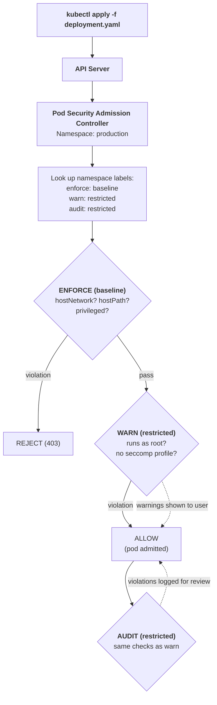

# Chapter 29: Pod Security Standards

A container is a process running on a Linux host. By default, Kubernetes places remarkably few restrictions on what that process can do. A pod can run as root, mount the host filesystem, share the host network namespace, escalate privileges, and disable security profiles. Each of these capabilities is a legitimate attack surface. Pod Security Standards define three profiles --- Privileged, Baseline, and Restricted --- that progressively lock down what pods are allowed to do. Pod Security Admission (PSA) enforces these profiles at the namespace level, providing a built-in mechanism to prevent dangerous pod configurations from ever reaching the cluster.

This chapter covers the standards themselves, the admission controller that enforces them, and the migration path from the now-removed PodSecurityPolicy (PSP) to the current model.

## Why Pod-Level Security Matters

Consider what an attacker gains from a compromised container with no security restrictions:

- **Privileged mode:** Full access to host devices, effectively root on the node
- **Host PID namespace:** See and signal every process on the node
- **Host network namespace:** Bind to any port on the node, sniff network traffic
- **hostPath volumes:** Read and write any file on the node filesystem
- **Root user:** Write to container filesystem, install tools, exploit kernel vulnerabilities
- **Privilege escalation:** Gain capabilities beyond the container's initial set
- **No seccomp profile:** Access the full set of ~300+ Linux syscalls, including dangerous ones like `ptrace`, `mount`, and `reboot`

Without pod security controls, every container is one exploit away from full node compromise. The standards exist to define a sensible default: what should a "normal" pod look like?

## The Three Profiles

### Controls Matrix

| Control | Privileged | Baseline | Restricted |
|---------|-----------|----------|------------|
| **Privileged containers** | Allowed | Forbidden | Forbidden |
| **Host namespaces** (hostPID, hostIPC, hostNetwork) | Allowed | Forbidden | Forbidden |
| **Host ports** | Allowed | Limited (known ranges) | Limited (known ranges) |
| **HostPath volumes** | Allowed | Forbidden | Forbidden |
| **Privileged escalation** (allowPrivilegeEscalation) | Allowed | Allowed | Forbidden (must be false) |
| **Running as root** (runAsNonRoot) | Allowed | Allowed | Forbidden (must be true) |
| **Root user** (runAsUser: 0) | Allowed | Allowed | Forbidden |
| **Capabilities** | All | Cannot add capabilities beyond the default Docker set (AUDIT_WRITE, CHOWN, DAC_OVERRIDE, FKILL, FSETID, KILL, MKNOD, NET_BIND_SERVICE, SETFCAP, SETGID, SETPCAP, SETUID, SYS_CHROOT) | Drop ALL, add only: NET_BIND_SERVICE |
| **Seccomp profile** | Any or none | Any or none | Must set RuntimeDefault or Localhost |
| **Volume types** | All | All except hostPath | Restricted set: configMap, downwardAPI, emptyDir, persistentVolumeClaim, projected, secret |
| **Sysctls** | All | Safe set only | Safe set only |
| **AppArmor** | Any or none | Any or none | Must not opt out of default profile |
| **SELinux** | Any | Cannot set MustRunAs type to escalating types | Cannot set MustRunAs type to escalating types |
| **/proc mount type** | Any | Default only | Default only |
| **Seccomp (ephemeral containers)** | Any | Any | Must set RuntimeDefault or Localhost |

### Profile Descriptions

**Privileged** --- No restrictions. Used for system-level workloads that genuinely need full host access: CNI plugins, storage drivers, logging agents that read `/var/log`, monitoring agents that access `/proc` and `/sys`. This profile should apply only to system namespaces (`kube-system`) and never to application workloads.

**Baseline** --- Prevents known privilege escalation paths. Blocks privileged containers, host namespaces, and hostPath volumes. Allows running as root and does not require seccomp profiles. This is the minimum viable security policy for application workloads. Most applications work under Baseline without modification.

**Restricted** --- Enforces current security best practices. Requires non-root execution, drops all capabilities, mandates seccomp profiles, and limits volume types. Many applications need modification to work under Restricted (switching from root to a non-root user, updating file permissions in the container image). This is the target state for all application workloads.

## Pod Security Admission (PSA)

Pod Security Admission is the built-in admission controller (enabled by default since Kubernetes 1.25) that enforces Pod Security Standards. It operates at the **namespace level** via labels.



### Namespace Labels

```yaml
apiVersion: v1
kind: Namespace
metadata:
  name: production
  labels:
    # Enforce: reject pods that violate the profile
    pod-security.kubernetes.io/enforce: baseline
    pod-security.kubernetes.io/enforce-version: v1.30

    # Warn: allow but show warnings for violations
    pod-security.kubernetes.io/warn: restricted
    pod-security.kubernetes.io/warn-version: v1.30

    # Audit: allow but log violations
    pod-security.kubernetes.io/audit: restricted
    pod-security.kubernetes.io/audit-version: v1.30
```

**The three modes serve different purposes:**

- **enforce** --- Hard block. The pod is rejected with a 403 error. Use for the profile you are confident about.
- **warn** --- Soft signal. The pod is admitted, but the user sees a warning in their kubectl output. Use for the profile you are migrating toward.
- **audit** --- Silent logging. The pod is admitted, and the violation is recorded in the audit log. Use for monitoring before tightening.

The recommended pattern is to **enforce the current standard and warn/audit at the next level up**. This gives teams visibility into what would break if you tightened the policy.

### Version Pinning

The `*-version` labels pin the profile to a specific Kubernetes version's definition. This prevents surprise breakage when you upgrade the cluster: a new Kubernetes version might add new checks to the Restricted profile, and pinning ensures the old definition is used until you explicitly update.

```yaml
# Pin to v1.30 definitions regardless of cluster version
pod-security.kubernetes.io/enforce-version: v1.30

# Use "latest" to always get the current version's definitions
pod-security.kubernetes.io/enforce-version: latest
```

## Migration from PodSecurityPolicy

PodSecurityPolicy (PSP) was removed in Kubernetes 1.25. If your cluster still relies on PSP, the migration to PSA follows a deliberate progression:

| Step | Action | Namespace Label |
|------|--------|----------------|
| **1. AUDIT** | Add audit labels to all namespaces.<br>Review audit logs for violations.<br>No impact on running workloads. | `audit: restricted` |
| **2. WARN** | Add warn labels.<br>Developers see warnings when deploying non-compliant pods.<br>Still no enforcement. | `warn: restricted` |
| **3. FIX** | Update workloads to comply:<br>- `runAsNonRoot: true`<br>- `seccompProfile: RuntimeDefault`<br>- Drop all capabilities<br>- Switch to non-root base images | (no label change) |
| **4. ENFORCE** | Add enforce labels.<br>Non-compliant pods are rejected.<br>Remove PSP resources. | `enforce: baseline`<br>`warn: restricted` |
| **5. TIGHTEN** | Move enforcement from baseline to restricted<br>as workloads are updated. | `enforce: restricted` |

### Common Migration Fixes

**Running as non-root:**
```yaml
spec:
  securityContext:
    runAsNonRoot: true
    runAsUser: 1000
    runAsGroup: 1000
    fsGroup: 1000
  containers:
    - name: app
      securityContext:
        allowPrivilegeEscalation: false
        capabilities:
          drop: ["ALL"]
        seccompProfile:
          type: RuntimeDefault
```

**Choosing a non-root base image:**
```dockerfile
FROM node:20-slim
# Create non-root user
RUN groupadd -r app && useradd -r -g app -d /app app
WORKDIR /app
COPY --chown=app:app . .
USER app
```

## Namespace Exemptions

Some namespaces legitimately need Privileged access. The PSA admission controller supports exemptions configured at the API server level:

```yaml
apiVersion: apiserver.config.k8s.io/v1
kind: AdmissionConfiguration
plugins:
  - name: PodSecurity
    configuration:
      apiVersion: pod-security.admission.config.k8s.io/v1
      kind: PodSecurityConfiguration
      defaults:
        enforce: baseline
        enforce-version: latest
        warn: restricted
        warn-version: latest
        audit: restricted
        audit-version: latest
      exemptions:
        usernames: []
        runtimeClasses: []
        namespaces:
          - kube-system        # System components need privileges
          - monitoring         # Node exporters need host access
          - storage-system     # CSI drivers need host access
```

This configuration sets cluster-wide defaults (enforce baseline, warn restricted) and exempts specific namespaces. Exempt namespaces are not subject to PSA checks at all, so apply RBAC and other controls carefully.

## When to Supplement with Kyverno or Gatekeeper

Pod Security Standards cover the most critical pod-level controls, but they are intentionally limited in scope. They do not address:

- **Image registry restrictions** (only allow images from approved registries)
- **Required labels or annotations** (every pod must have `team` and `cost-center` labels)
- **Resource limits** (every container must have CPU and memory limits)
- **Specific capability requirements** (allow NET_RAW for ping utilities)
- **Per-workload exceptions** (allow hostNetwork for a specific DaemonSet but not others)
- **Custom validation** (container images must use digest references, not tags)

For these use cases, supplement PSA with Kyverno or OPA Gatekeeper. The recommended pattern:

1. **PSA handles the broad security baseline** (enforce at the namespace level, zero configuration per workload)
2. **Kyverno/Gatekeeper handles fine-grained policies** (per-resource exceptions, organizational standards, image policies)

```yaml
# Kyverno: require resource limits on all containers
apiVersion: kyverno.io/v1
kind: ClusterPolicy
metadata:
  name: require-resource-limits
spec:
  validationFailureAction: Enforce
  rules:
    - name: check-limits
      match:
        any:
          - resources:
              kinds:
                - Pod
      validate:
        message: "All containers must have CPU and memory limits."
        pattern:
          spec:
            containers:
              - resources:
                  limits:
                    cpu: "?*"
                    memory: "?*"
```

## A Practical Security Posture

```
RECOMMENDED PSA CONFIGURATION
───────────────────────────────

  Namespace Type          Enforce      Warn         Audit
  ──────────────          ───────      ────         ─────
  kube-system             privileged   ---          ---
  monitoring              privileged   ---          ---
  storage-system          privileged   ---          ---
  application-dev         baseline     restricted   restricted
  application-staging     restricted   restricted   restricted
  application-production  restricted   restricted   restricted

  Start with baseline enforcement for dev namespaces.
  Move to restricted as workloads are updated.
  Production should enforce restricted from the start
  for new applications.
```

## Common Mistakes and Misconceptions

- **"Running as root in a container is the same as root on the host."** Without proper configuration, it can be. Container root can escape to host root via privileged containers, host mounts, or kernel exploits. Always set `runAsNonRoot: true` and drop capabilities.
- **"Pod Security Standards are optional."** Without enforcement (via PSS labels or admission controllers), any user who can create pods can create privileged pods. Default to `restricted` and grant exceptions explicitly.
- **"My application needs `privileged: true`."** Very few applications genuinely need host-level access. Most cases can be solved with specific Linux capabilities (NET_BIND_SERVICE, SYS_PTRACE) instead of full privilege.

## Further Reading

- [Pod Security Standards](https://kubernetes.io/docs/concepts/security/pod-security-standards/) --- Profile definitions
- [Pod Security Admission](https://kubernetes.io/docs/concepts/security/pod-security-admission/) --- Enforcement mechanism
- [Migrate from PodSecurityPolicy](https://kubernetes.io/docs/tasks/configure-pod-container/migrate-from-psp/) --- Migration guide
- [Kyverno policies](https://kyverno.io/policies/) --- Policy library for supplemental controls

---

*Part 6 shifts from securing workloads to scaling them.*

Next: [Horizontal Pod Autoscaler](30-hpa.md)
