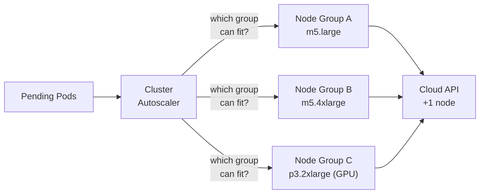
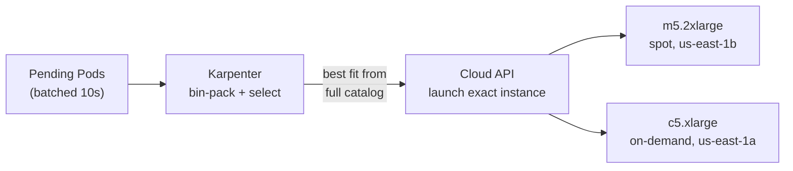
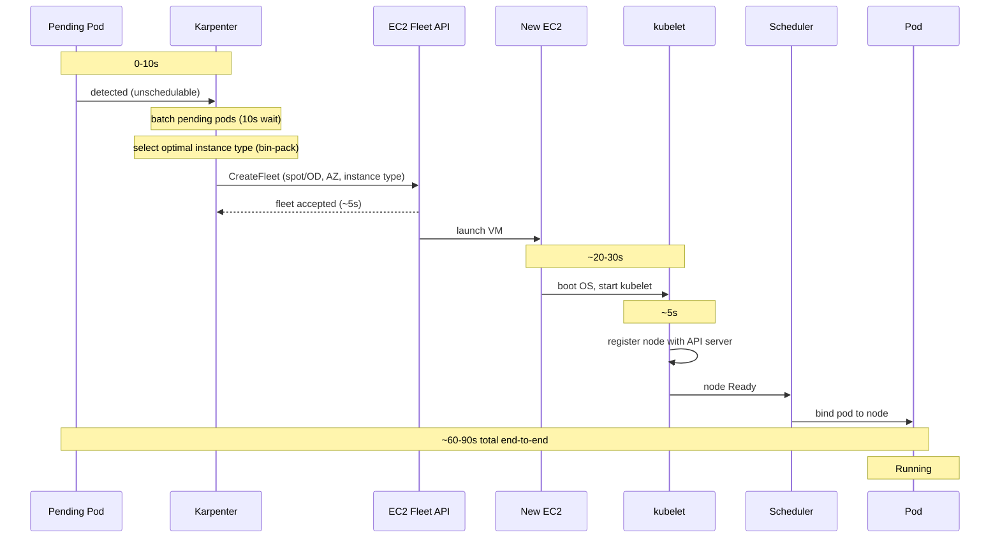

# Chapter 32: Node Scaling: Cluster Autoscaler and Karpenter

When pods cannot be scheduled due to insufficient cluster capacity, the system must provision new nodes. When nodes sit idle, it must remove them.

Two tools dominate this space: the **Cluster Autoscaler**, which has been the standard since 2016, and **Karpenter**, which rethinks node provisioning from first principles. Understanding both requires understanding why one emerged to replace the other and the architectural difference that makes Karpenter faster, cheaper, and simpler.

## Cluster Autoscaler

The Cluster Autoscaler (CA) is a Kubernetes controller that watches for pods stuck in the `Pending` state due to insufficient resources. When it finds them, it asks the cloud provider to add nodes. When nodes are underutilized, it drains and removes them.

### How It Works



> **Key constraint:** Each node group is a fixed pool of identical instances. CA picks a group and increments its count — it cannot mix instance types or optimize across groups.

The critical abstraction is the **node group** (called Auto Scaling Group on AWS, Managed Instance Group on GCP, VM Scale Set on Azure). Each node group is a pool of identically configured nodes: same instance type, same labels, same taints. The Cluster Autoscaler does not provision individual machines --- it increments or decrements a node group's desired count.

### The Latency Problem

Cluster Autoscaler's end-to-end scaling latency typically runs 3--4 minutes:

1. **Detection (0--30s):** CA polls for unschedulable pods every 10 seconds.
2. **Decision (10--30s):** CA simulates scheduling against each node group template.
3. **Cloud API (30--60s):** The cloud provider acknowledges the scale-up request.
4. **Instance launch (60--120s):** The VM boots, pulls the OS image, starts kubelet.
5. **Node ready (10--30s):** kubelet registers with the API server, node passes health checks.

For workloads that can tolerate minutes of latency, this is acceptable. For latency-sensitive services, it is not.

### Multi-Cloud Support

CA's strength is breadth. It supports AWS, GCP, Azure, OpenStack, vSphere, and more. For teams running Kubernetes on-premise or on non-AWS clouds, CA is often the only option.

## Karpenter

Karpenter takes a fundamentally different approach. Instead of managing node groups, it provisions individual nodes with the exact size and configuration needed for the pending pods. There are no pre-defined node groups. Karpenter looks at what pods need and picks the optimal instance type, availability zone, and purchase option (on-demand vs spot) in a single step.

### Architecture



> **Key difference:** No node groups. Karpenter evaluates the full instance type catalog, bin-packs pending pods, and launches exactly the right instance — type, size, AZ, and purchase option — in a single API call.

### Why Karpenter Is Architecturally Superior

The node group abstraction that Cluster Autoscaler depends on is the root cause of most of its limitations:

**Instance type rigidity.** A node group has a single instance type (or a mixed-instance policy with limitations). If your workload needs 7.5 GB of memory, and your node group uses `m5.large` (8 GB), you waste very little. But if it needs 9 GB, you must either use a different node group with `m5.xlarge` (16 GB) --- wasting 7 GB --- or create a new node group for every size bracket. In practice, teams maintain 3--10 node groups, each an imperfect approximation.

Karpenter eliminates this entirely. It evaluates the full instance type catalog and picks the cheapest instance that fits the pending pods after bin-packing. If three pending pods need 2 CPU + 4 GB each, Karpenter might choose a single `m5.xlarge` (4 CPU, 16 GB) rather than three separate nodes.

**Scaling speed.** Karpenter's end-to-end latency is approximately 60--90 seconds --- roughly 2--3x faster than Cluster Autoscaler. It skips the node group indirection and calls the cloud API directly. It also batches pending pods for 10 seconds before making a decision, which produces better bin-packing.

The following sequence diagram shows the timing of each step in Karpenter's scaling cascade --- notice the 10-second batching window that enables better bin-packing:



**Consolidation.** Karpenter continuously evaluates whether existing nodes can be consolidated. If node A is 30% utilized and node B is 25% utilized, Karpenter can cordon both, move their pods to a single smaller node, and terminate the originals. Cluster Autoscaler can only scale down nodes that are underutilized --- it cannot replace a node with a smaller one.

**Disruption budgets.** Karpenter respects `NodePool` disruption budgets that control how many nodes can be disrupted simultaneously during consolidation, drift remediation, or node expiry. This prevents consolidation from causing service disruptions.

### Karpenter Configuration

```yaml
apiVersion: karpenter.sh/v1
kind: NodePool
metadata:
  name: general-purpose
spec:
  template:
    spec:
      requirements:
        - key: karpenter.sh/capacity-type
          operator: In
          values: ["on-demand", "spot"]
        - key: kubernetes.io/arch
          operator: In
          values: ["amd64"]
        - key: karpenter.k8s.aws/instance-family
          operator: In
          values: ["m5", "m6i", "m6a", "c5", "c6i"]
      nodeClassRef:
        group: karpenter.k8s.aws
        kind: EC2NodeClass
        name: default
  limits:
    cpu: "1000"
    memory: 2000Gi
  disruption:
    consolidationPolicy: WhenEmptyOrUnderutilized
    consolidateAfter: 1m
    budgets:
      - nodes: "10%"
```

## Comparison

| Aspect | Cluster Autoscaler | Karpenter |
|---|---|---|
| **Abstraction** | Node groups (ASG/MIG) | Direct instance provisioning |
| **Instance selection** | Fixed per node group | Dynamic per scheduling batch |
| **Scale-up latency** | 3--4 minutes | ~60--90 seconds |
| **Scale-down** | Remove underutilized nodes | Consolidation (replace + remove) |
| **Bin-packing** | Limited (one group at a time) | Cross-instance-type optimization |
| **Spot handling** | Mixed instance policies | First-class, per-node decisions |
| **Cloud support** | AWS, GCP, Azure, others | AWS (GA), Azure (GA via AKS Node Autoprovision since late 2024) |
| **Configuration** | Node groups + CA flags | NodePool CRDs |
| **Maturity** | 8+ years, battle-tested | Younger, rapidly maturing |

## When to Use Each

**Use Cluster Autoscaler when:**
- You run on GCP, OpenStack, vSphere, or bare metal
- Your organization requires the stability of a long-established project
- You have existing node group infrastructure and limited appetite for migration

**Use Karpenter when:**
- You run on AWS or Azure (AKS Node Autoprovision, GA since late 2024)
- You want faster scaling, better bin-packing, and automated cost optimization
- You are starting a new cluster or willing to migrate from node groups
- You run diverse workloads that benefit from flexible instance type selection

For most AWS-based clusters starting today, Karpenter is the better default. Its consolidation alone typically reduces node costs by 20--35% compared to Cluster Autoscaler with static node groups.

## Common Mistakes and Misconceptions

- **"Cluster Autoscaler scales down immediately."** CA waits 10 minutes (default `scale-down-delay-after-add`) before considering a node for removal, then checks if pods can be moved safely. Scale-down is intentionally conservative.
- **"Spot/preemptible instances are unreliable for anything."** With proper pod disruption budgets, multiple instance types, and spread across availability zones, spot instances work well for stateless services. Karpenter handles spot interruptions by proactively replacing nodes.

## Further Reading

- [Cluster Autoscaler FAQ](https://github.com/kubernetes/autoscaler/blob/master/cluster-autoscaler/FAQ.md) --- Detailed behavior documentation
- [Karpenter Documentation](https://karpenter.sh/docs/) --- Official Karpenter docs
- [Karpenter Best Practices](https://aws.github.io/aws-eks-best-practices/karpenter/) --- AWS EKS guide
- [Karpenter Migration Guide](https://karpenter.sh/docs/getting-started/migrating-from-cas/) --- Migrating from Cluster Autoscaler

---

*Next: [Resource Tuning Deep Dive](33-resource-tuning.md) --- CFS quotas, CPU throttling, QoS classes, and why removing CPU limits sometimes improves performance.*
