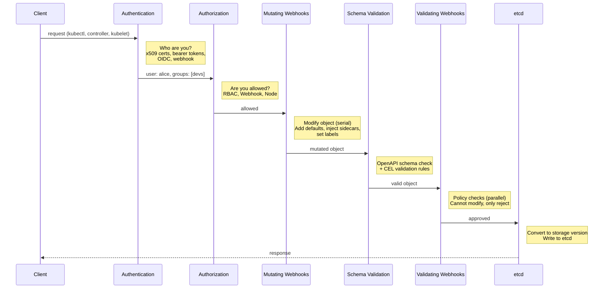
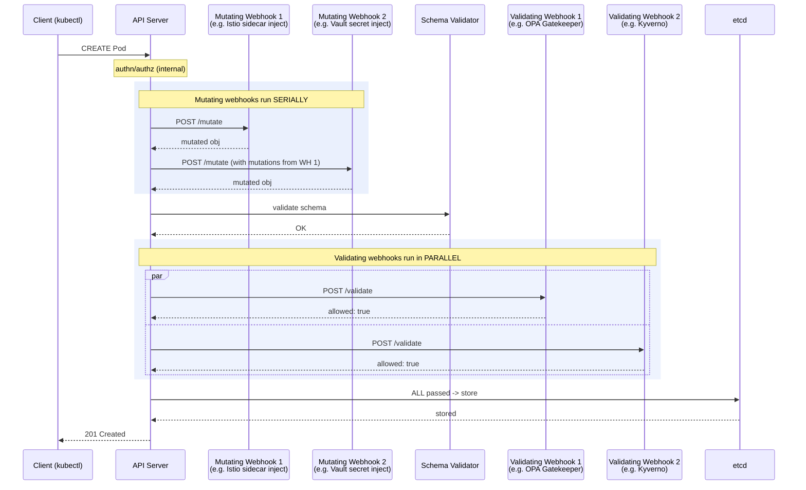
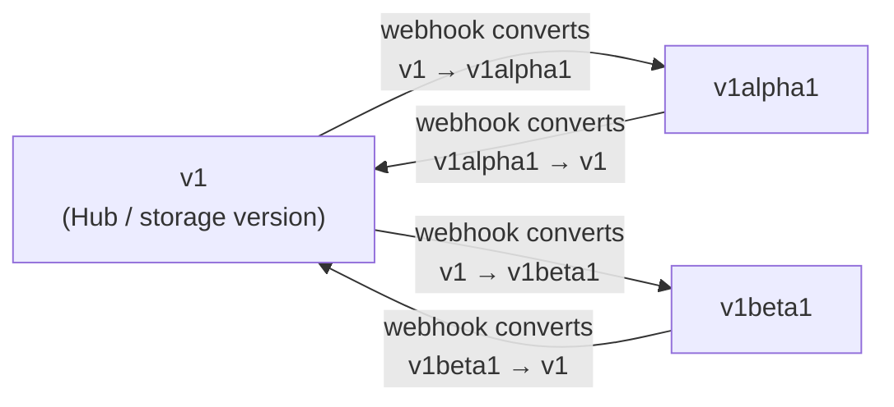

# Chapter 39: The Kubernetes API Internals

Every interaction with a Kubernetes cluster --- every `kubectl apply`, every controller reconciliation, every kubelet heartbeat --- is an HTTP request to the API server.

This chapter covers the internal request lifecycle, API versioning mechanics, aggregated API servers, admission webhooks, conversion webhooks, and the priority and fairness system that prevents any single tenant from overwhelming the control plane.

## API Groups and Versioning

Kubernetes organizes its API into **groups**. The core group (empty string, paths under `/api/v1`) contains the original resources: Pods, Services, ConfigMaps, Secrets. Everything added later lives in named groups under `/apis/` --- `apps/v1` for Deployments, `batch/v1` for Jobs, `networking.k8s.io/v1` for Ingress.

Each group can serve multiple versions simultaneously, but only one is the **storage version** --- the format actually written to etcd. When you create a Deployment via `apps/v1`, the API server converts it to the storage version before writing. When you read via a different version, it converts from storage on the way out.

### Version Progression

Versions follow a strict graduation path:

| Stage | Convention | Meaning |
|---|---|---|
| Alpha | `v1alpha1` | Disabled by default. May change or be removed without notice. Never use in production. |
| Beta | `v1beta1` | Enabled by default (since 1.24, beta APIs require explicit opt-in for new APIs). Schema is mostly stable but may change. Migration path will be provided. |
| Stable | `v1` | GA. The API is committed. Breaking changes require a new group or version. |

The version in the group name (`v1`, `v2`) is the *API version*, not the software version. `autoscaling/v2` replaced `autoscaling/v2beta2` when HPA's extended metrics support graduated.

## The API Request Lifecycle

Every request to the API server passes through a series of stages.



The ordering of mutating before validating is deliberate. Mutating webhooks may add fields that validating webhooks then check. If validation ran first, it would reject objects that mutating webhooks would have fixed.

## Aggregated API Servers

Not every API endpoint is served by the core API server. The **aggregation layer** allows you to register custom API servers that handle specific API groups. The core API server proxies requests to these backends transparently.

This is how the metrics API (`metrics.k8s.io`) works. The metrics-server registers an `APIService` object:

```yaml
apiVersion: apiregistration.k8s.io/v1
kind: APIService
metadata:
  name: v1beta1.metrics.k8s.io
spec:
  service:
    name: metrics-server
    namespace: kube-system
  group: metrics.k8s.io
  version: v1beta1
  groupPriorityMinimum: 100
  versionPriority: 100
```

When a client requests `kubectl top pods`, the API server sees that `metrics.k8s.io` is handled by the metrics-server Service and proxies the request there. Authentication and authorization still happen at the front door --- the aggregated server receives the request with identity headers already set.

They require their own storage, their own availability guarantees, and careful certificate management. For most use cases, CRDs are the simpler extension mechanism. Use aggregated APIs when you need custom storage backends, custom admission logic baked into the server, or sub-resource behaviors that CRDs cannot express.

## Admission Webhooks

Admission webhooks are the primary extension point for policy enforcement and object mutation. They intercept requests after authentication and authorization but before storage.

### Mutating Admission Webhooks

Mutating webhooks are called **in serial**, but the invocation order is determined by the API server (alphabetically by webhook name) and should not be relied upon. Each webhook can modify the object, and subsequent webhooks see the modifications made by previous ones. Furthermore, the API server may **re-invoke** mutating webhooks if a later webhook modifies the object, to give earlier webhooks a chance to react. Design mutating webhooks to be idempotent and order-independent. Common uses:

- Injecting sidecar containers (Istio, Linkerd)
- Adding default labels and annotations
- Setting resource requests/limits from policy
- Rewriting image references to use a private registry mirror

### Validating Admission Webhooks

Validating webhooks are called **in parallel** after all mutating webhooks have run. They cannot modify the object --- they can only accept or reject it. If any validating webhook rejects, the request is denied. Common uses:

- Enforcing naming conventions
- Requiring specific labels (owner, cost-center)
- Blocking privileged containers
- Preventing deployments to protected namespaces

### The Admission Webhook Pipeline

The following diagram traces a Pod creation through the full admission webhook pipeline, showing how mutating webhooks run serially (each receiving the output of the previous one) while validating webhooks run in parallel (all must allow for the request to succeed).



### Configuration Details

A webhook configuration includes several critical fields:

```yaml
apiVersion: admissionregistration.k8s.io/v1
kind: ValidatingWebhookConfiguration
metadata:
  name: require-labels
webhooks:
  - name: require-labels.example.com
    rules:
      - apiGroups: ["apps"]
        apiVersions: ["v1"]
        operations: ["CREATE", "UPDATE"]
        resources: ["deployments"]
    clientConfig:
      service:
        name: label-enforcer
        namespace: policy-system
      caBundle: <base64-encoded-CA>
    failurePolicy: Fail        # or Ignore
    sideEffects: None           # None, NoneOnDryRun, or Unknown
    timeoutSeconds: 5           # default 10, max 30
    matchConditions:            # CEL-based filtering (beta 1.28, GA 1.30)
      - name: exclude-system
        expression: "!object.metadata.namespace.startsWith('kube-')"
```

**`failurePolicy`** controls what happens when the webhook itself is unreachable or returns an error. `Fail` means the API request is rejected --- safe but can block the entire cluster if the webhook goes down. `Ignore` means the request proceeds without the webhook check --- available but potentially unsafe. In production, `Fail` is the correct default for security-critical webhooks, but you must ensure the webhook is highly available.

**`sideEffects`** declares whether the webhook has side effects beyond modifying the admission response. Webhooks that write to external systems should declare this honestly; it affects dry-run behavior.

**`matchConditions`** (beta in Kubernetes 1.28, GA in 1.30) use CEL expressions to filter which objects actually get sent to the webhook. This is far more efficient than filtering inside the webhook itself, because non-matching objects never leave the API server.

**`timeoutSeconds`** sets how long the API server waits for a webhook response. Keep this low (3--5 seconds). A slow webhook adds latency to every matching API request. A webhook that consistently times out under `failurePolicy: Fail` will make the cluster unusable.

## Conversion Webhooks

When a CRD serves multiple versions, the API server needs a way to convert between them. For trivial changes, Kubernetes can handle this automatically. For structural changes, you deploy a **conversion webhook**.

The model is **hub and spoke**: you designate one version as the "hub" (typically the storage version), and the webhook converts between the hub and every other version. This avoids the combinatorial explosion of converting between every pair of versions.



Conversion webhooks must be lossless --- converting v1beta1 → v1 → v1beta1 must produce the original object. If a new version adds fields that older versions lack, use annotations to preserve the data during round-trips. This is subtle and error-prone; test conversion extensively.

## API Priority and Fairness

A single misbehaving controller can issue thousands of LIST requests and overwhelm the API server, starving kubelet heartbeats and other critical traffic. **API Priority and Fairness (APF)** prevents this by categorizing requests into priority levels and applying fair queuing within each level.

### How It Works

1. **FlowSchemas** classify incoming requests. Each FlowSchema matches requests by user, group, namespace, verb, or resource and assigns them to a **priority level**.

2. **Priority levels** define how much of the API server's capacity is allocated to that class of traffic. Higher-priority levels get more capacity and can borrow from lower levels.

3. Within a priority level, **fair queuing** ensures that no single flow (e.g., requests from one service account) monopolizes the allocation.

The system ships with several built-in FlowSchemas:

| FlowSchema | Priority Level | Purpose |
|---|---|---|
| `exempt` | `exempt` | Health checks, system:masters. No queuing. |
| `system-leader-election` | `leader-election` | Controller manager, scheduler leader election. |
| `system-nodes` | `system` | Kubelet requests. Must not be starved. |
| `kube-controller-manager` | `workload-high` | Built-in controllers. |
| `service-accounts` | `workload-low` | Default for service account traffic. |
| `global-default` | `global-default` | Catch-all for unmatched requests. |

The `exempt` level is special --- requests skip all queuing and rate limiting. This ensures that the API server can always respond to its own health checks and that break-glass admin access is never throttled.

### Diagnosing APF Issues

When requests are being throttled, the API server returns `429 Too Many Requests` with a `Retry-After` header. The `apiserver_flowcontrol_dispatched_requests_total` and `apiserver_flowcontrol_rejected_requests_total` metrics reveal which priority levels are saturated.

If your operator is being throttled, the fix is usually one of:

1. Reduce the request rate (use watches instead of polling, use caches, reduce list scope with label selectors).
2. Create a dedicated FlowSchema that assigns your operator to a higher priority level.
3. Increase the concurrency shares for the relevant priority level.

Option 1 is almost always the right answer. Options 2 and 3 just shift the problem to other tenants.

## Design Implications

Understanding the API internals changes how you build on Kubernetes:

**Webhook placement matters.** A mutating webhook that injects sidecars adds latency to every pod creation. Measure it. Keep webhook logic fast and simple. Avoid calling external services from inside a webhook.

**Conversion webhooks are migration infrastructure.** Plan for them from the start if your CRD is likely to evolve. Design your v1 storage version with enough flexibility that you do not need structural changes with every release.

**APF protects the control plane from you.** If your operator lists all pods in a 10,000-pod cluster every 30 seconds, APF will eventually throttle it. Use informer caches, label selectors, and field selectors to minimize API server load.

**Authentication is pluggable.** The API server does not care how you prove your identity --- it supports client certificates, OIDC tokens, webhook-based token review, and service account tokens.
## Common Mistakes and Misconceptions

- **"Admission webhooks are fire-and-forget."** A failing webhook can block all resource creation in your cluster. Always configure `failurePolicy: Ignore` for non-critical webhooks and ensure webhook services have high availability.
- **"Mutating and validating webhooks run in any order."** Mutating webhooks run first (and can run multiple rounds), then validating webhooks run. A validating webhook sees the final mutated object, not the original user submission.
- **"CRDs are free to create."** Each CRD adds load to the API server: storage in etcd, watch channels, discovery endpoints. Hundreds of CRDs (common with Crossplane providers) measurably increase API server memory and CPU usage.

## Further Reading

- [Dynamic Admission Control](https://kubernetes.io/docs/reference/access-authn-authz/extensible-admission-controllers/) --- the official Kubernetes documentation on mutating and validating admission webhooks, including configuration, failure policies, and reinvocation.
- [Webhook Configuration Reference](https://kubernetes.io/docs/reference/access-authn-authz/webhook/) --- details on configuring webhook authentication and authorization backends, including token review and subject access review webhooks.
- [API Aggregation Layer](https://kubernetes.io/docs/concepts/extend-kubernetes/api-extension/apiserver-aggregation/) --- how to extend the Kubernetes API with your own API server registered via APIService objects, including when to use aggregation versus CRDs.
- [Versions in CustomResourceDefinitions](https://kubernetes.io/docs/tasks/extend-kubernetes/custom-resources/custom-resource-definition-versioning/) --- how CRD versioning works, including storage versions, conversion webhooks, and strategies for evolving your API without breaking clients.
- [Extending the Kubernetes API](https://kubernetes.io/docs/concepts/extend-kubernetes/api-extension/) --- an overview comparing CRDs and aggregated API servers, covering the tradeoffs and use cases for each extension mechanism.
- [The Life of a Kubernetes API Request](https://www.youtube.com/watch?v=ryeINNfVOi8) --- a KubeCon talk that traces a request through authentication, authorization, admission, validation, and storage, visualizing the full request pipeline.
- [API Priority and Fairness](https://kubernetes.io/docs/concepts/cluster-administration/flow-control/) --- the official documentation on APF, covering FlowSchemas, PriorityLevelConfigurations, and how the API server prevents any single client from starving others.

---

**Next:** [etcd Operations](40-etcd-ops.md) --- the database that stores everything, and how to keep it healthy.
