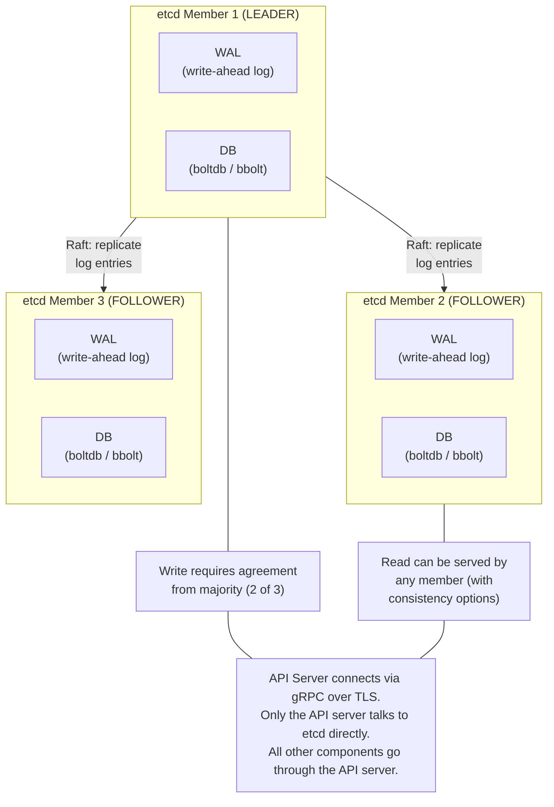
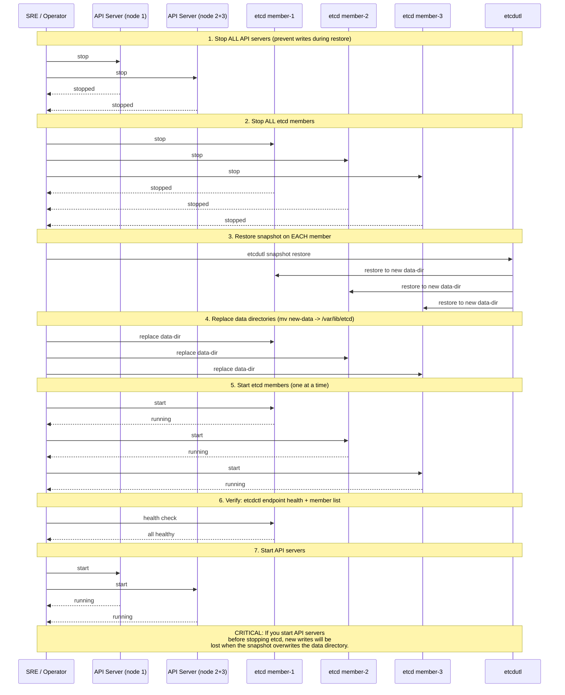

# Chapter 40: etcd Operations

Every object in a Kubernetes cluster --- every Pod, every Secret, every ConfigMap, every CRD instance --- exists as a key-value pair in etcd. There is no secondary database, no cache that can reconstruct state. If etcd loses data, the cluster loses its memory. If etcd becomes slow, every API server call becomes slow. If etcd goes down, the cluster is effectively frozen: controllers cannot reconcile, the scheduler cannot place pods, and kubectl returns errors.

This chapter covers backup, restore, maintenance, monitoring, and the disaster recovery procedures you hope to never need.

## What etcd Stores

etcd is a distributed key-value store that uses the Raft consensus protocol for replication. In a Kubernetes cluster, the API server is the only client --- all reads and writes go through it. etcd stores:

- All resource objects (Pods, Services, Deployments, Secrets, etc.)
- Cluster configuration (RBAC rules, admission configurations)
- Lease objects (node heartbeats, leader election)
- Custom resources (anything registered via CRDs)
- Events (though these are often short-lived)

The data is stored under a key hierarchy rooted at `/registry/`. A Pod named `nginx` in namespace `default` lives at `/registry/pods/default/nginx`.

## etcd Cluster Architecture



Raft requires a **quorum** --- a majority of members --- to commit writes. With 3 members, you can lose 1. With 5, you can lose 2. Always run an **odd** number of members. An even number provides no additional fault tolerance (4 members still tolerates only 1 failure, same as 3) while increasing the coordination overhead.

## Backup

A backup you have never tested is wishful thinking.

### Taking a Snapshot

```bash
# Using etcdctl (the network-aware CLI)
ETCDCTL_API=3 etcdctl snapshot save /backup/etcd-snapshot.db \
  --endpoints=https://127.0.0.1:2379 \
  --cacert=/etc/kubernetes/pki/etcd/ca.crt \
  --cert=/etc/kubernetes/pki/etcd/server.crt \
  --key=/etc/kubernetes/pki/etcd/server.key

# Verify the snapshot
etcdctl snapshot status /backup/etcd-snapshot.db --write-out=table
```

The snapshot captures the entire database at a point in time. Schedule snapshots at least every hour for production clusters. Store them off-cluster --- in object storage (S3, GCS) with versioning enabled.

### What Snapshots Do Not Capture

Snapshots capture etcd data only. They do not capture:
- Container images (stored in registries)
- Persistent volume data (stored on disks/NAS/cloud volumes)
- External secrets (in Vault, AWS Secrets Manager, etc.)
- Certificates (unless stored as Kubernetes Secrets)

A complete disaster recovery plan must address all of these.

## Restore

Restoring from a snapshot is a destructive operation. It creates a new etcd data directory with a new cluster ID. All existing members must be stopped, and the new data directory must be distributed to all of them.

### The Restore Command

Since etcd 3.5.x, the `etcdctl snapshot restore` command is **deprecated**. Use `etcdutl` instead:

```bash
# etcdutl operates on local files --- no network connection needed
etcdutl snapshot restore /backup/etcd-snapshot.db \
  --data-dir=/var/lib/etcd-restored \
  --name=etcd-member-1 \
  --initial-cluster="etcd-member-1=https://10.0.1.10:2380,\
etcd-member-2=https://10.0.1.11:2380,\
etcd-member-3=https://10.0.1.12:2380" \
  --initial-cluster-token=etcd-cluster-restored \
  --initial-advertise-peer-urls=https://10.0.1.10:2380
```

### etcdctl vs etcdutl

This distinction confuses many operators:

| Tool | Scope | Example Operations |
|---|---|---|
| `etcdctl` | Network operations. Talks to a running etcd server over gRPC. | `snapshot save`, `get`, `put`, `member list`, `endpoint health` |
| `etcdutl` | File operations. Works on local data files without a running server. | `snapshot restore`, `snapshot status`, `defrag` (offline) |

The rule of thumb: if the cluster is running and you are interacting with it, use `etcdctl`. If the cluster is down and you are operating on files, use `etcdutl`.

## Compaction

etcd is a **versioned** key-value store. Every write creates a new revision. By default, etcd keeps all historical revisions, which means the database grows indefinitely. Compaction removes revisions older than a specified point.

```bash
# Get the current revision
rev=$(etcdctl endpoint status --write-out="json" | jq '.[0].Status.header.revision')

# Compact everything older than current revision minus 10000
etcdctl compact $((rev - 10000))
```

Kubernetes API server handles compaction automatically via the `--etcd-compaction-interval` flag (default: 5 minutes). The API server compacts revisions older than the specified interval. You rarely need to run compaction manually unless the automatic process has fallen behind.

## Defragmentation

Compaction marks old revisions as deleted but does not reclaim disk space. The database file retains its size (or grows) because bbolt uses a free-list internally. **Defragmentation** rewrites the database to reclaim this space.

```bash
# Online defragmentation (one member at a time)
etcdctl defrag --endpoints=https://10.0.1.10:2379

# Offline defragmentation (member must be stopped)
etcdutl defrag --data-dir=/var/lib/etcd
```

Defragmentation is an expensive operation that briefly blocks reads and writes on the affected member. In a multi-member cluster, defragment one member at a time, waiting for it to catch up with the leader before moving to the next. Never defragment the leader first --- defragment followers, then transfer leadership, then defragment the old leader.

## Performance Tuning

etcd is exquisitely sensitive to disk I/O latency. The single most impactful tuning decision is **giving etcd dedicated, fast storage**.

### Hardware Recommendations

- **Disk:** NVMe SSD or high-IOPS cloud volumes (gp3 with provisioned IOPS on AWS, pd-ssd on GCP). etcd's WAL fsync is on the critical path for every write. Spinning disks are unacceptable. Network-attached storage with unpredictable latency is dangerous.
- **CPU:** 2--4 dedicated cores. etcd is not CPU-intensive but is sensitive to scheduling delays.
- **Memory:** 8 GB is sufficient for most clusters. etcd memory-maps its database, so larger databases need proportionally more RAM.
- **Network:** Low-latency links between members. Raft consensus requires leader-to-follower round trips for every write. Cross-region etcd clusters are a recipe for latency problems.

### Dedicated Machines

For production clusters, run etcd on dedicated nodes --- not co-located with the API server or other control plane components. A CPU-hungry admission webhook or a memory leak in the scheduler should not be able to starve etcd of resources.

### Tuning Parameters

```bash
# Increase heartbeat interval for high-latency networks (default 100ms)
--heartbeat-interval=250

# Increase election timeout proportionally (default 1000ms)
--election-timeout=2500

# Set snapshot count (how many transactions between snapshots)
--snapshot-count=10000

# Set quota backend bytes (database size limit, default 2GB, max 8GB)
--quota-backend-bytes=8589934592
```

The `--quota-backend-bytes` is a safety valve. When the database exceeds this limit, etcd switches to read-only mode to prevent unbounded growth. If this happens, you must compact and defragment to get below the limit before etcd will accept writes again.

## Key Monitoring Metrics

Monitor these metrics to catch problems before they become outages:

| Metric | What It Tells You | Alert Threshold |
|---|---|---|
| `etcd_mvcc_db_total_size_in_bytes` | Database size. Indicates growth trends. | > 6 GB (approaching 8 GB quota) |
| `etcd_disk_wal_fsync_duration_seconds` | WAL write latency. The canary for disk problems. | p99 > 10ms |
| `etcd_disk_backend_commit_duration_seconds` | Backend commit latency. | p99 > 25ms |
| `etcd_network_peer_round_trip_time_seconds` | Peer-to-peer latency. | p99 > 50ms |
| `etcd_server_proposals_failed_total` | Failed Raft proposals. Indicates leader instability. | Any increase |
| `etcd_server_leader_changes_seen_total` | Leader elections. Frequent changes signal network or disk issues. | > 3 per hour |
| `etcd_server_has_leader` | Whether this member sees a leader. | 0 for > 30s |

The WAL fsync duration is the single most important metric. When disk latency increases, writes slow down, Raft heartbeats are delayed, followers fall behind, and the leader may trigger unnecessary elections. Everything cascades from slow disks.

## Scaling the Cluster

### Adding Members

```bash
# Add a new member (run from existing cluster)
etcdctl member add etcd-member-4 \
  --peer-urls=https://10.0.1.13:2380

# Start the new member with --initial-cluster-state=existing
```

New members join as learners (non-voting) until they catch up with the leader's log, then promote to full voting members. Always add one member at a time and wait for it to become healthy before adding the next.

### Removing Members

```bash
# Get member ID
etcdctl member list

# Remove the member
etcdctl member remove <member-id>
```

When scaling from 3 to 5 members, you gain tolerance for 2 failures instead of 1, but you increase the write latency (the leader must wait for acknowledgment from 3 members instead of 2). Most clusters should stay at 3 or 5 members; 7+ members hurt write latency without meaningful availability gain.

## Disaster Recovery Procedure

When etcd is down and you have a snapshot, follow this sequence.

The following sequence diagram shows the exact ordering of a disaster recovery restore. **The order is critical** --- starting API servers before etcd is stopped, or restoring only some members, causes data loss or split-brain:



Follow these steps:

1. **Stop all API servers.** They will reconnect when etcd is back.
2. **Stop all etcd members.**
3. **Restore the snapshot** on each member using `etcdutl snapshot restore` with the correct `--name`, `--initial-cluster`, and `--initial-advertise-peer-urls` for each member.
4. **Replace the data directory** on each member with the restored data.
5. **Start all etcd members** simultaneously (or within a few seconds of each other).
6. **Verify cluster health:** `etcdctl endpoint health`
7. **Start the API servers.**
8. **Verify cluster state:** `kubectl get nodes`, `kubectl get pods --all-namespaces`

After a restore, the cluster will be in the state captured by the snapshot. Any objects created between the snapshot and the failure are lost. This is why frequent snapshots and short RPO targets matter.

If only one member has failed (and quorum is maintained), do not restore from a snapshot. Instead, remove the failed member, provision a new one, and add it to the cluster. The Raft protocol will replicate the current state to the new member automatically.

## Common Mistakes and Misconceptions

- **"etcd backs up automatically in managed Kubernetes."** True for the control plane etcd in EKS/GKE/AKS. But if you run self-managed clusters or use etcd for other purposes, backups are your responsibility. Test restores regularly.
- **"etcd can store large values."** etcd has a default per-value limit of 1.5 MB. Storing large ConfigMaps, Secrets, or CRDs that approach this limit degrades performance. Keep resources small.
- **"Adding more etcd nodes improves write performance."** More nodes means more Raft acknowledgments per write --- 7+ members hurt, not help, write performance.

## Further Reading

- [etcd Documentation](https://etcd.io/docs/latest/) --- the official etcd docs covering installation, configuration, clustering, authentication, and the client API.
- [etcd Performance](https://etcd.io/docs/latest/op-guide/performance/) --- benchmarking methodology and tuning guidance for etcd, including disk I/O recommendations, network latency requirements, and how to interpret benchmark results.
- [etcd Disaster Recovery](https://etcd.io/docs/latest/op-guide/recovery/) --- step-by-step procedures for recovering an etcd cluster from snapshot backups, including single-member and multi-member restore workflows.
- [etcd FAQ](https://etcd.io/docs/latest/faq/) --- answers to common operational questions about etcd, including cluster sizing, data size limits, request size limits, and performance expectations.
- [Operating etcd Clusters for Kubernetes](https://kubernetes.io/docs/tasks/administer-cluster/configure-upgrade-etcd/) --- the Kubernetes-specific guide for setting up, backing up, and upgrading etcd, including TLS configuration and snapshot best practices.
- [etcd-operator (archived)](https://github.com/coreos/etcd-operator) --- the original CoreOS operator for managing etcd clusters on Kubernetes, now archived but valuable as a reference for understanding automated etcd lifecycle management.
- [Auger](https://github.com/etcd-io/auger) --- a tool for directly decoding and inspecting Kubernetes objects stored in etcd, useful for debugging and understanding how the API server serializes resources.

---

**Next:** [GPU Workloads and AI/ML on Kubernetes](41-gpu-ml.md) --- how GPUs are exposed to the scheduler, shared between workloads, and orchestrated for distributed training.
