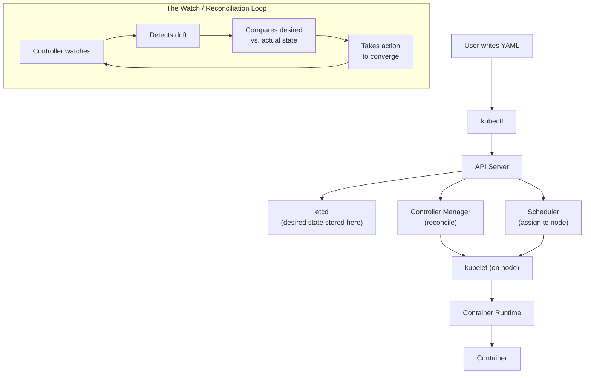
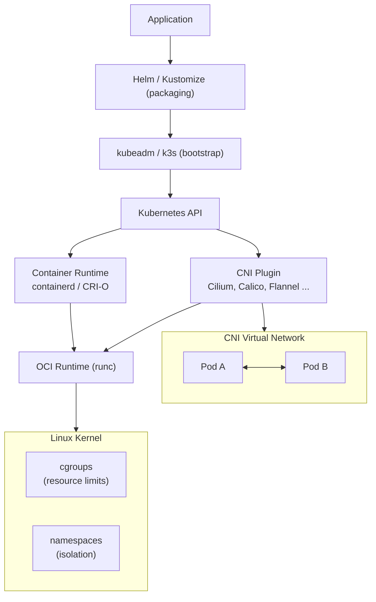
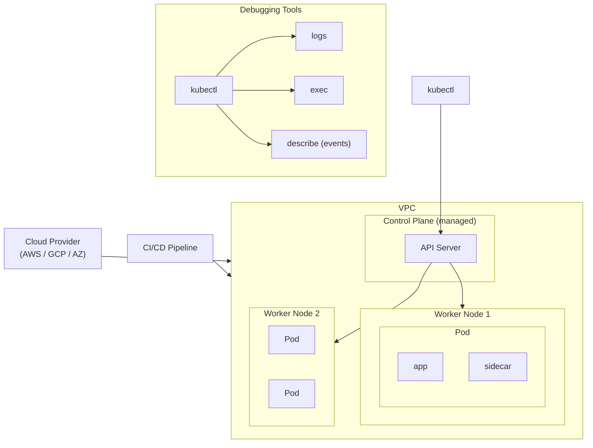
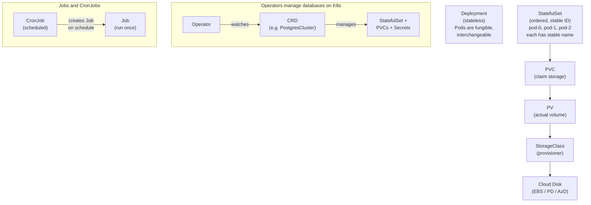
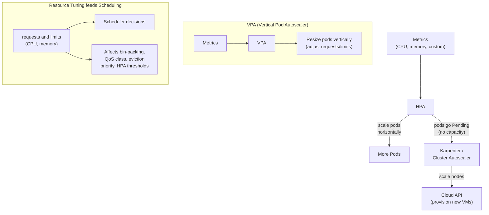
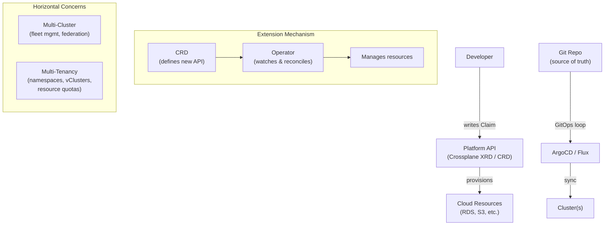

# Appendix B: Mental Models

Each part of this book introduces a cluster of related concepts. These diagrams show how they connect — use them as maps when navigating the chapters.

---

## Part 1: First Principles (Chapters 1-9)

**The Reconciliation Loop — the heart of Kubernetes.**



---

## Part 2: Tooling Evolution (Chapters 10-14)

**The Stack — what runs on what.**



---

## Part 3: Practical Setup (Chapters 15-19)

**Your First Cluster — who talks to whom.**



---

## Part 4: Stateful Workloads (Chapters 20-24)

**State — the hard problem.**



---

## Part 5: Security (Chapters 25-29)

**Defense in Depth.**

```
    ┌────────────────────────────────────────────────────────┐
    │  Supply Chain (outermost ring)                         │
    │  Sigstore, SBOM, image scanning                        │
    │                                                        │
    │  ┌─────────────────────────────────────────────────┐   │
    │  │  Cluster                                        │   │
    │  │  RBAC, Admission Control (OPA/Kyverno)          │   │
    │  │                                                 │   │
    │  │  ┌─────────────────────────────────────────┐    │   │
    │  │  │  Namespace                              │    │   │
    │  │  │  NetworkPolicy, ResourceQuota           │    │   │
    │  │  │                                         │    │   │
    │  │  │  ┌─────────────────────────────────┐    │    │   │
    │  │  │  │  Pod                            │    │    │   │
    │  │  │  │  SecurityContext, Seccomp,      │    │    │   │
    │  │  │  │  AppArmor                       │    │    │   │
    │  │  │  │                                 │    │    │   │
    │  │  │  │  ┌─────────────────────────┐    │    │    │   │
    │  │  │  │  │  Container (innermost)  │    │    │    │   │
    │  │  │  │  │  read-only rootfs       │    │    │    │   │
    │  │  │  │  │  non-root user          │    │    │    │   │
    │  │  │  │  │  dropped capabilities   │    │    │    │   │
    │  │  │  │  └─────────────────────────┘    │    │    │   │
    │  │  │  └─────────────────────────────────┘    │    │   │
    │  │  └─────────────────────────────────────────┘    │   │
    │  └─────────────────────────────────────────────────┘   │
    └────────────────────────────────────────────────────────┘

    Secrets Management (cross-cutting concern):
    ┌──────────────────────────────────────────────┐
    │                                              │
    │  External Secrets ──▶ K8s Secret ──▶ Pod     │
    │       │                                      │
    │  Vault / AWS SM / GCP SM                     │
    │  (source of truth)                           │
    │                                              │
    │  Cuts across ALL rings above                 │
    └──────────────────────────────────────────────┘
```

---

## Part 6: Scaling (Chapters 30-33)

**The Scaling Cascade — metrics to machines.**



---

## Part 7: Platform Engineering (Chapters 34-39)

**The Platform — abstraction over infrastructure.**



---

## Part 8: Advanced Topics (Chapters 40-45)

**Running it for Real.**

```
    Operational Concerns:
    ┌──────────────────────────────────────────────────────┐
    │                                                      │
    │  ┌──────────┐  ┌────────────────┐  ┌─────────────┐   │
    │  │ etcd ops │  │ Disaster       │  │ Cost        │   │
    │  │ (backup, │  │ Recovery       │  │ Optimization│   │
    │  │  defrag, │  │ (Velero)       │  │ (right-size,│   │
    │  │  health) │  │                │  │  spot, idle)│   │
    │  └──────────┘  │ backup ──▶     │  └─────────────┘   │
    │                │ restore ──▶    │                    │
    │                │ migrate        │                    │
    │                └────────────────┘                    │
    └──────────────────────────────────────────────────────┘

    Observability (the three pillars):
            ┌───────────┐
            │  Metrics  │
            │(Prometheus│
            │ / Mimir)  │
            └─────┬─────┘
                  │
        ┌─────────┼─────────┐
        │         │         │
        ▼         ▼         ▼
    ┌───────┐ ┌───────┐ ┌────────┐
    │ Logs  │ │Traces │ │Alerts  │
    │(Loki) │ │(Tempo)│ │(Grafana│
    └───────┘ └───────┘ │ / PD)  │
                        └────────┘

    GPU Scheduling:
    ┌──────────────────┐     ┌──────────────────┐     ┌────────────┐
    │  Pod with        │────▶│  Device Plugin / │────▶│ NVIDIA GPU │
    │  gpu request     │     │  DRA             │     │ (on node)  │
    │  (limits:        │     │  (allocates GPU) │     │            │
    │   nvidia.com/gpu)│     └──────────────────┘     └────────────┘
    └──────────────────┘

    LLM Serving:
    ┌─────────┐    ┌──────────────┐    ┌──────────┐    ┌────────────┐
    │ Model   │───▶│ vLLM / TGI   │───▶│ KServe   │───▶│ Inference  │
    │(weights)│    │ (serving     │    │ (routing,│    │ endpoint   │
    │         │    │  engine)     │    │  scaling)│    │ (/predict) │
    └─────────┘    └──────────────┘    └──────────┘    └────────────┘
```

---

*Back to [Table of Contents](00-README.md)*
