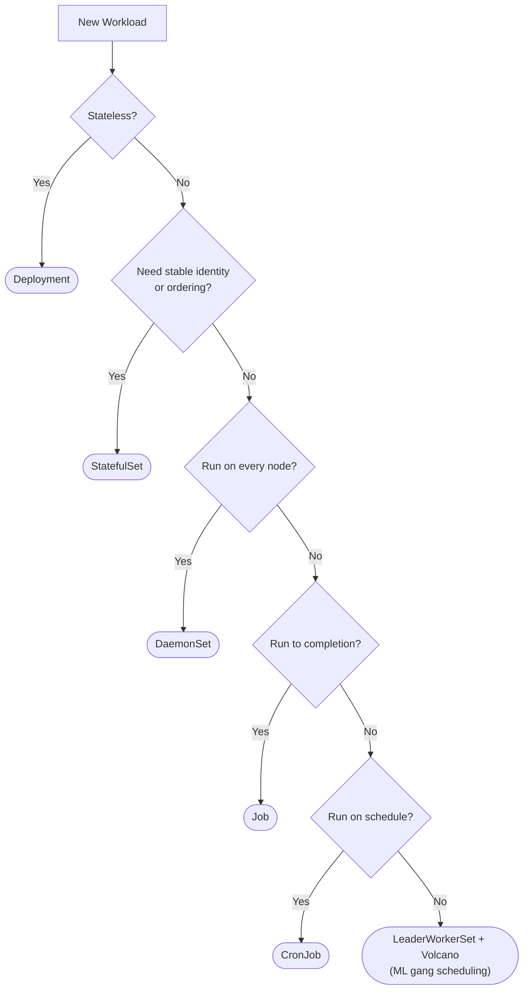
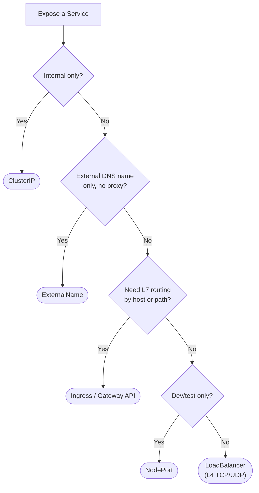
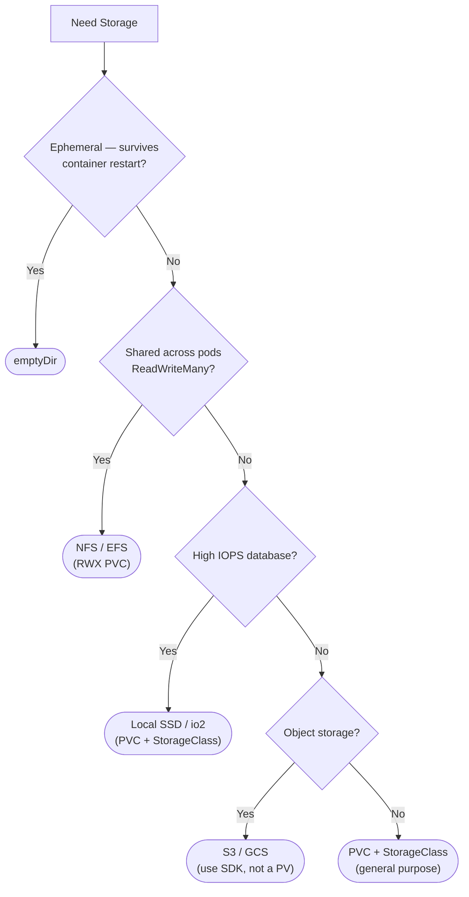
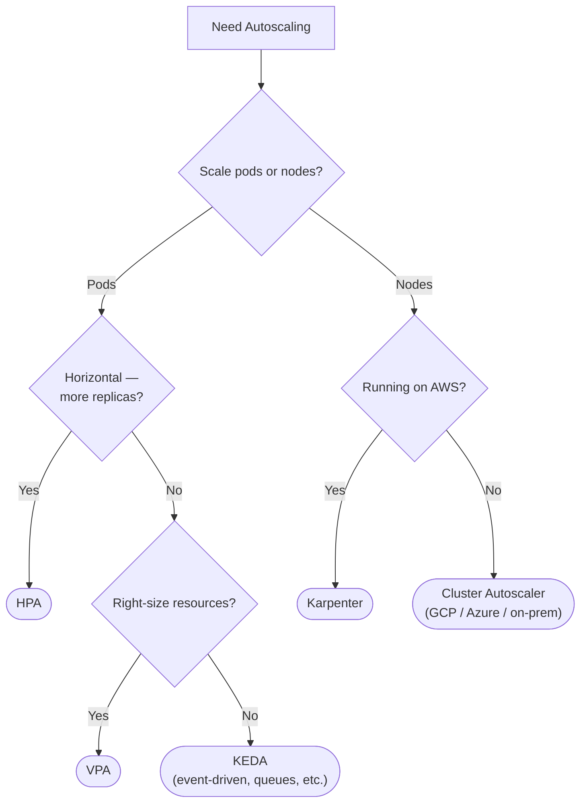
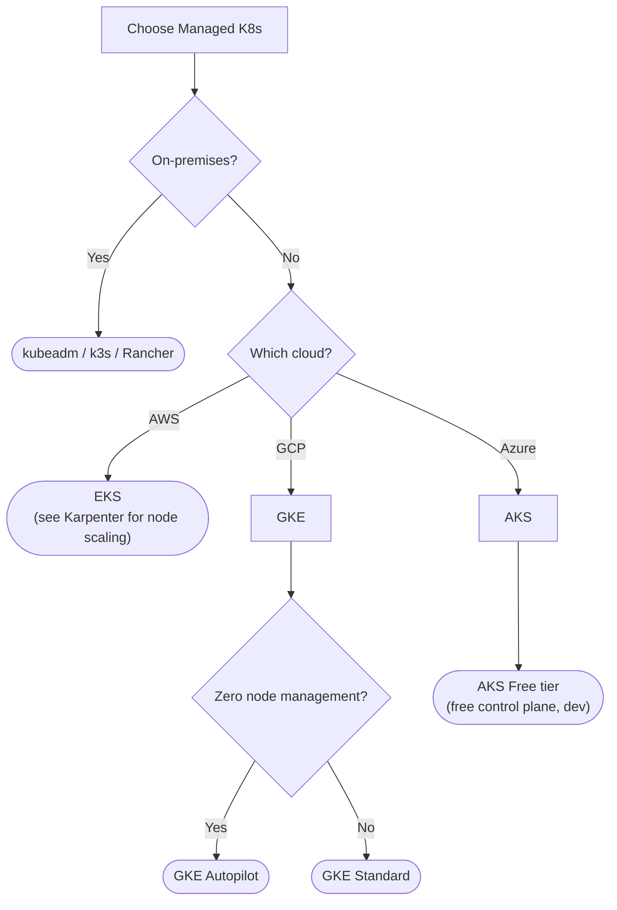
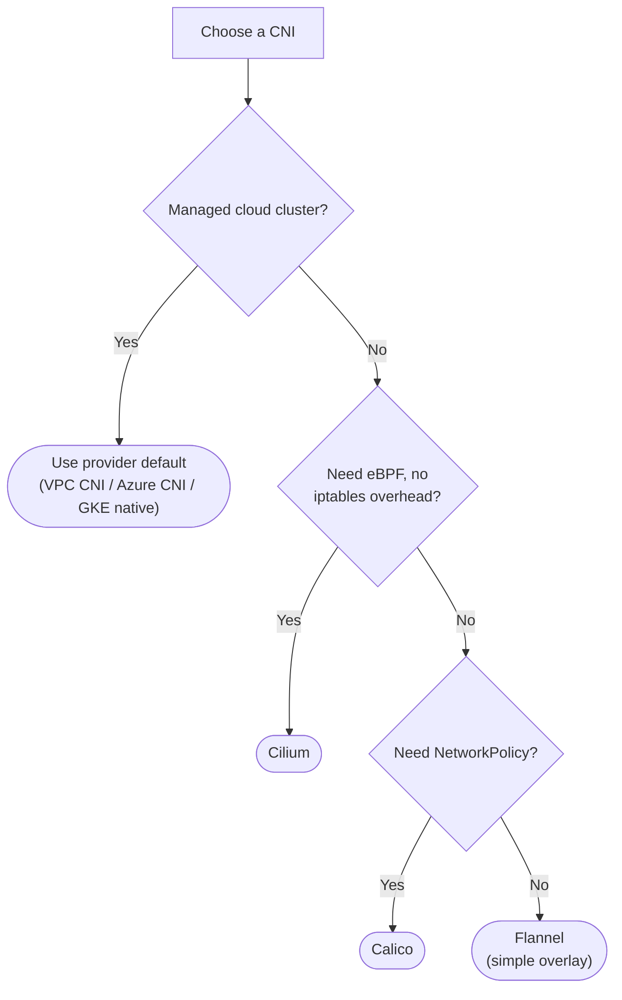
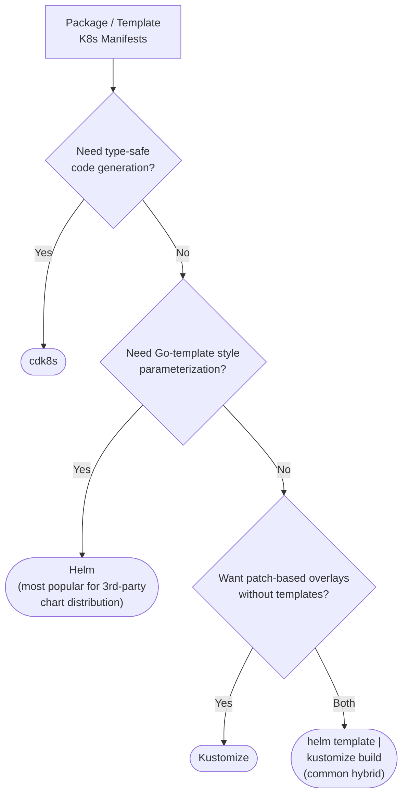
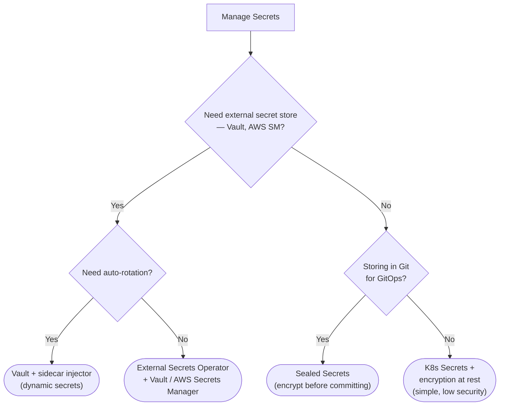
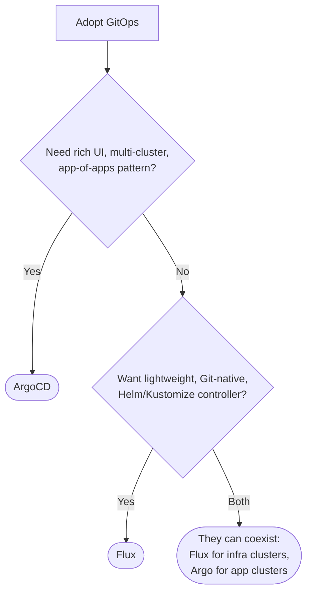
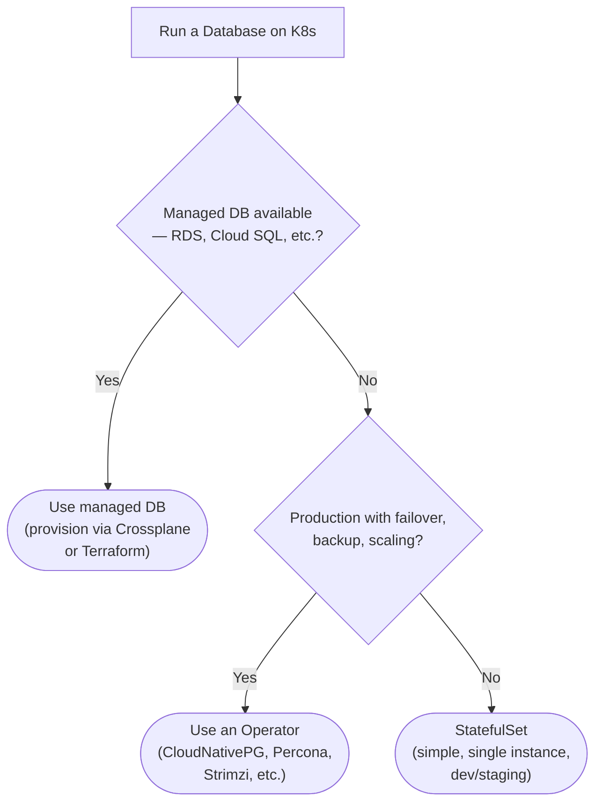

# Appendix C: Decision Trees

Kubernetes offers many options for the same problem. These decision trees encode the trade-offs discussed throughout the book into quick-reference flowcharts.

---

## 1. Which Workload Controller?

Kubernetes provides several controllers for running workloads, each designed for a different scheduling pattern. [Chapter 18](18-first-workloads.md) covers Deployments and Services, [Chapter 21](21-statefulsets.md) covers StatefulSets, [Chapter 24](24-jobs.md) covers Jobs and CronJobs, and [Chapter 42](42-llm-infrastructure.md) covers LeaderWorkerSet for ML gang scheduling. Start by asking whether your workload is stateless.

---

## 2. Which Service Type?

Every application that receives traffic needs a Service, but Kubernetes offers five types with very different behaviors. [Chapter 18](18-first-workloads.md) introduces ClusterIP and NodePort, [Chapter 17](17-cloud-integration.md) covers LoadBalancer integration with cloud providers, and [Chapter 13](13-networking-evolution.md) discusses Ingress and the newer Gateway API.

---

## 3. Which Storage?

Storage decisions depend on durability, access patterns, and whether multiple pods need simultaneous access. [Chapter 23](23-storage.md) covers PersistentVolumes, StorageClasses, and CSI drivers in depth. [Chapter 17](17-cloud-integration.md) explains how cloud providers implement storage backends.

---

## 4. Which Autoscaler?

Kubernetes scaling operates at two levels: pod-level (adding replicas or resizing resource requests) and node-level (adding machines when pods can't be scheduled). [Chapter 30](30-hpa.md) covers HPA, [Chapter 31](31-vpa.md) covers VPA, [Chapter 32](32-node-scaling.md) covers Karpenter and Cluster Autoscaler, and [Chapter 33](33-resource-tuning.md) explains how resource requests feed into scheduling.

---

## 5. Which Managed Kubernetes?

The choice between managed and self-managed Kubernetes depends on your infrastructure constraints and operational maturity. [Chapter 16](16-managed-k8s.md) compares EKS, GKE, and AKS in detail. [Chapter 15](15-cluster-setup.md) covers kubeadm for self-managed clusters, and [Chapter 11](11-cluster-bootstrap.md) covers k3s and other lightweight distributions.

---

## 6. Which CNI?

The Container Network Interface plugin determines how pods get IP addresses and how network traffic flows between nodes. Most managed clusters default to the cloud provider's native CNI, but self-managed clusters require an explicit choice. [Chapter 13](13-networking-evolution.md) traces the evolution from Flannel through Calico to Cilium and explains the eBPF performance advantage.

---

## 7. Which Package Manager?

Managing Kubernetes YAML at scale requires tooling — the question is which kind. Helm uses Go templates for parameterization and dominates third-party chart distribution. Kustomize uses overlay-based patching without any template language. Many teams combine both. [Chapter 12](12-package-management.md) covers all three approaches and explains when to use each.

---

## 8. Which Secret Management?

Secrets require special handling: they must not appear in plain text in Git, they may need to rotate automatically, and they often originate from an external vault or cloud provider. [Chapter 28](28-secrets.md) covers Kubernetes Secrets and encryption at rest, Sealed Secrets for GitOps, and integration with HashiCorp Vault and cloud secret managers via the External Secrets Operator.

---

## 9. Which GitOps Tool?

GitOps applies the Kubernetes reconciliation pattern to deployment itself: a controller watches a Git repository and ensures the cluster matches. The two major tools are ArgoCD and Flux, which differ primarily in UI richness and multi-cluster management. [Chapter 12](12-package-management.md) covers both, and [Chapter 34](34-multi-cluster.md) discusses multi-cluster GitOps patterns.

---

## 10. StatefulSet vs Operator for Databases?

Running databases on Kubernetes is possible but requires careful consideration. A managed cloud database (RDS, Cloud SQL) avoids the operational burden entirely. If you must run on K8s, operators like CloudNativePG and Percona handle failover, backups, and scaling automatically. A raw StatefulSet works for dev/staging but lacks production automation. [Chapter 22](22-databases.md) covers this decision in depth, and [Chapter 37](37-operators.md) explains the operator pattern.

---

*Back to [Table of Contents](00-README.md)*
