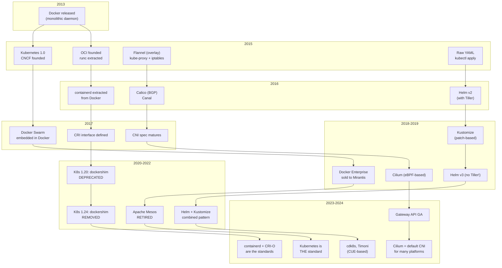
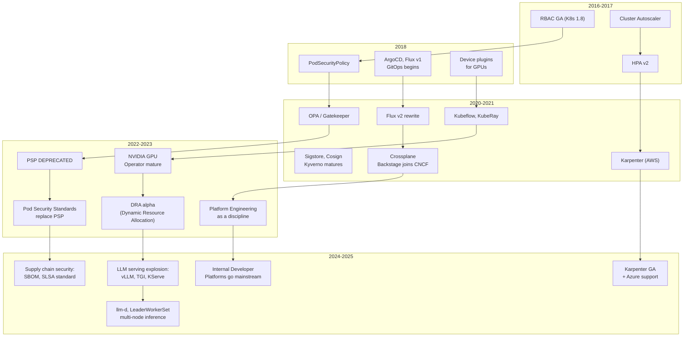
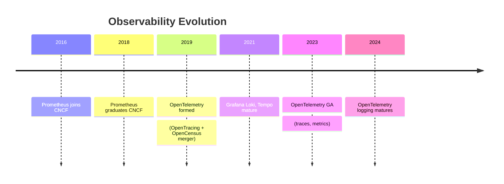

# Appendix E: Architecture Evolution Timeline

Kubernetes and its ecosystem have evolved rapidly since 2014. This timeline shows the major architectural shifts — each one driven by real problems with the previous approach. Understanding this evolution explains why the current ecosystem looks the way it does.

---

## Visual Timeline (2013-2026)

### Container Runtimes, Orchestration, Networking, and Package Management

Four parallel evolutions that shaped the infrastructure layer: Docker's monolith was decomposed into containerd and CRI-O. The orchestration wars ended with Kubernetes as the universal standard. Networking shifted from overlays and iptables to eBPF-native with Cilium. And YAML management evolved from raw manifests through Helm's Tiller era to today's Helm v3 + Kustomize hybrid.

### Security, GitOps, Scaling, and GPU/ML

Security moved from the flawed PodSecurityPolicy to the simpler Pod Security Standards, while policy engines like OPA and Kyverno filled the gap. GitOps went from manual kubectl to ArgoCD/Flux, then broadened into full Internal Developer Platforms. Scaling evolved from the slow, group-based Cluster Autoscaler to Karpenter's per-pod provisioning. And GPU/ML infrastructure exploded from basic device plugins to DRA, vLLM, and disaggregated serving with llm-d.

### Observability

Observability converged from three fragmented signals — Prometheus for metrics, various tools for logs, and Jaeger/Zipkin for traces — into a unified standard with OpenTelemetry. The Grafana LGTM stack (Loki, Grafana, Tempo, Mimir) emerged as the dominant open-source backend.

---

## Node Autoscaling: The CA-to-Karpenter Transition

| | Cluster Autoscaler (2016) | | Karpenter (2021+) |
|---|---|---|---|
| **Abstraction** | Node-group based | **→** | Groupless provisioning |
| **Scaling unit** | Scale by group min/max | **→** | Per-pod scheduling |
| **Speed** | Slow (minutes) | **→** | Fast (seconds) |
| **Bin-packing** | No | **→** | Cross-instance-type optimization |
| **Consolidation** | Reactive only | **→** | Active consolidation |
| **Instance types** | Fixed per group | **→** | Works across all types |

> **Why it changed:** Cluster Autoscaler couldn't keep up with diverse GPU/ML workloads that needed fast, flexible provisioning across many instance types. Karpenter eliminated the node group abstraction entirely.

---

## Summary: Architectural Shifts by Domain

| Domain | Old Way | New Way | Why It Changed |
|---|---|---|---|
| **Container Runtime** | Docker (monolithic daemon) | containerd / CRI-O via CRI | Docker included too much (build, swarm, CLI). K8s only needs a runtime. CRI allows pluggable runtimes. |
| **Orchestration** | Docker Swarm, Mesos, multiple options | Kubernetes (universal standard) | K8s won on extensibility (CRDs, operators) and ecosystem. Swarm was too simple, Mesos too complex. |
| **Networking** | Flannel overlay + iptables kube-proxy | Cilium (eBPF) + Gateway API | iptables doesn't scale. Overlay adds latency. eBPF gives kernel-level networking without kube-proxy. |
| **Package Management** | Raw YAML / Helm v2 with Tiller | Helm v3 + Kustomize (or combined) | Tiller was a security risk (cluster-admin in-cluster). Raw YAML doesn't compose. Kustomize avoids templating. |
| **Security** | PodSecurityPolicy (PSP) | Pod Security Standards (PSS) + Kyverno/OPA | PSP was confusing, hard to audit, and couldn't be extended. PSS is simpler; policy engines are more flexible. |
| **GitOps & Platform** | Manual kubectl apply / CI pipelines | ArgoCD/Flux + Internal Developer Platforms | Imperative deploys are fragile and unauditable. GitOps makes the desired state declarative and versioned. |
| **Scaling** | Cluster Autoscaler (node-group based) | Karpenter (groupless, per-pod) | CA was slow and inflexible with diverse workloads. Karpenter provisions exactly what's needed, fast. |
| **GPU/ML** | Basic device plugins | GPU Operator + DRA + specialized serving (vLLM, llm-d) | LLM explosion demands multi-node GPU scheduling, fractional GPUs, and inference-optimized runtimes. |
| **Observability** | Prometheus + ad-hoc logging/tracing | OpenTelemetry (unified) + Grafana stack | Three separate telemetry signals (metrics, logs, traces) needed a unified collection and correlation standard. |

---

*Back to [Table of Contents](00-README.md)*
